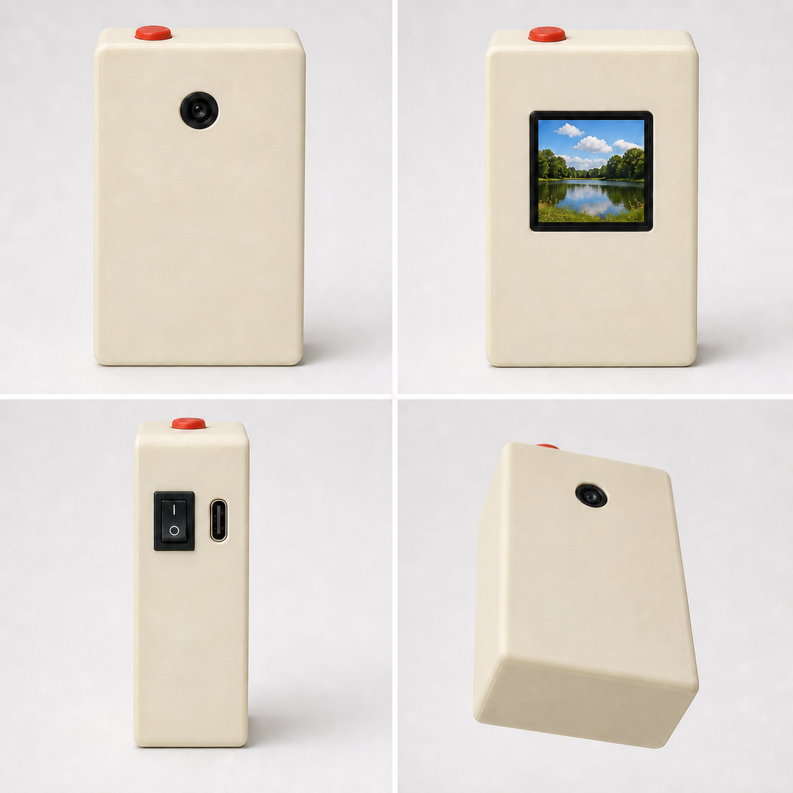
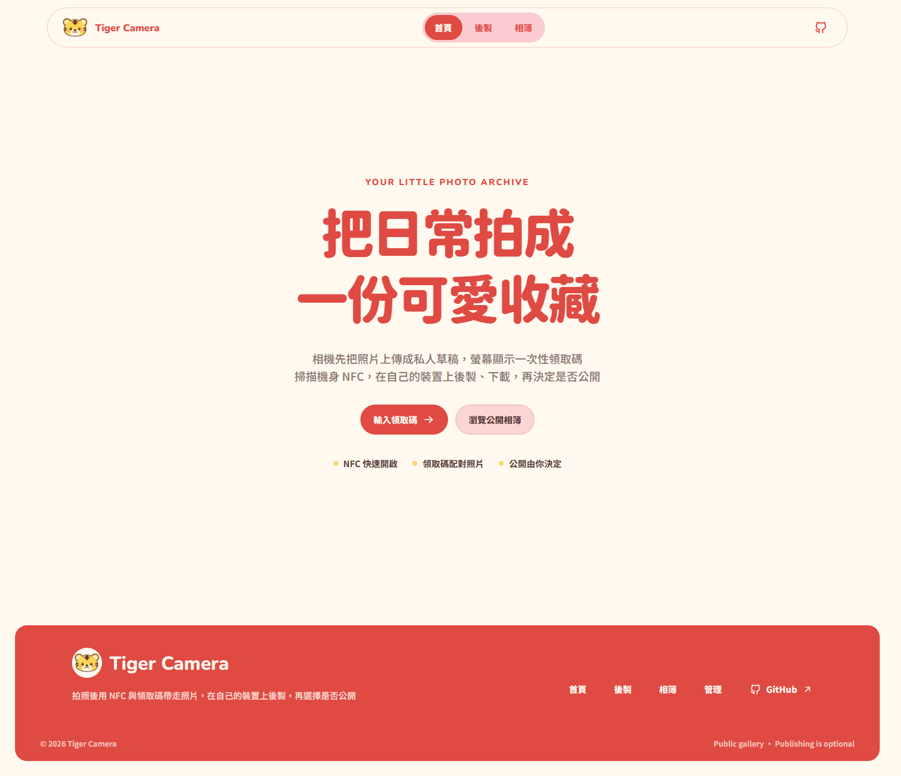
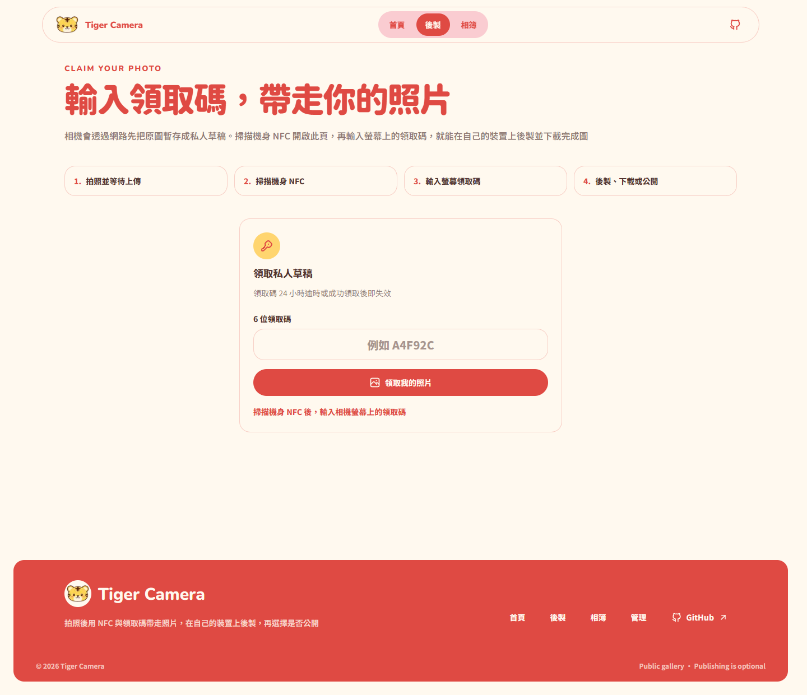
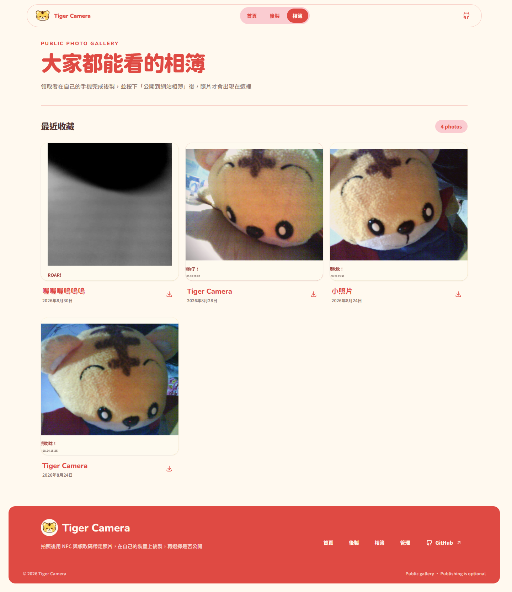

# Tiger Camera

一台結合 ESP32-S3-CAM、手機後製與公開相簿的 DIY 相機，讓每次按下快門都能留下可下載、可分享的照片。

Tiger Camera 以 ESP32-S3-CAM 與 OV2640 為核心，拍照後透過 Wi-Fi 暫存照片。使用者掃描機身 NFC、輸入螢幕上的領取碼，就能直接在手機瀏覽器完成後製、下載，或將成品公開到網站相簿。



## 核心特色

- 短按快門即可拍攝 JPEG，並在小型 TFT 螢幕上回顧照片
- 透過 2.4 GHz Wi-Fi 上傳私人照片草稿
- NFC 開啟領取頁，再以六位領取碼取得自己的照片
- 手機瀏覽器直接後製，不需要安裝 App
- 可選擇：
  - 拍立得白邊框
  - 拍攝日期與時間
  - 自訂文字或可愛預設文字
  - 直式 3:4、橫式 4:3、方形 1:1
  - 多種可愛風格濾鏡
- 完成圖可下載，也可以選擇公開到相簿
- 公開相片支援放大檢視與下載
- 原始照片只作為私人暫存，永久保存的是後製完成圖

## 功能

### 相機端

- 實體快門短按拍攝 JPEG，拍攝後立即在 ST7735 螢幕回顧
- 以 PSRAM 保留最新一張照片；下一次成功拍攝時覆蓋上一張
- 顯示 Wi-Fi、上傳與電池狀態，網路暫時中斷時不影響基本拍照
- 連線至指定的 2.4 GHz Wi-Fi，不需要相機自行建立 Wi-Fi 熱點

### 網站端

- NFC 導向領取頁，輸入相機顯示的六位領取碼即可取得照片
- 在手機瀏覽器完成裁切比例、拍立得框、日期、文字與風格處理
- 支援直式 3:4、橫式 4:3、方形 1:1，不改變原照片方向
- 成品可直接下載；公開後會出現在公開相簿並可放大檢視與下載
- 原始照片只在領取與後製期間保存；網站永久保存後製成品
- 公開相簿由管理員維護，管理員可重新命名或永久刪除公開照片

## 網站

- 公開網站：[tiger-camera.fengyenchia.com](https://tiger-camera.fengyenchia.com)
- 使用流程：開啟網站的 `/create` 頁面 → 輸入相機顯示的六位領取碼 → 後製 → 下載或公開
- 公開相簿：[tiger-camera.fengyenchia.com/gallery](https://tiger-camera.fengyenchia.com/gallery)

### 網站畫面







## 使用流程

```text
按下快門
    ↓
相機拍攝並連線上傳私人草稿
    ↓
掃描 NFC，開啟 Tiger Camera 網站
    ↓
輸入螢幕上的六位領取碼
    ↓
在手機選擇版型、文字與濾鏡
    ↓
下載完成圖，或公開到相簿
```

領取碼是照片配對用的一次性代碼；照片在領取前保持私人狀態，公開與否由領取者決定。

## 照片資料流程

```text
1. 按下相機快門
   ↓
2. ESP32-S3-CAM 擷取 JPEG，暫存在 PSRAM
   ↓
3. 相機以固定的裝置上傳 Token，透過 HTTPS 上傳私人草稿
   ↓
4. Backend 將原圖存入 Cloudflare R2，並在 Neon 建立草稿 metadata
   ↓
5. Backend 回傳六位領取碼；相機將領取碼顯示在螢幕上
   ↓
6. 使用者掃描 NFC、開啟 /create，輸入領取碼
   ↓
7. Backend 核發該照片的一次性領取權杖，瀏覽器取得私人原圖
   ↓
8. 使用者在手機 Canvas 完成裁切、框線、日期、文字與濾鏡
   ↓
9. 使用者下載成品，或明確選擇公開
   ↓
10. 公開時 Backend 儲存後製 JPEG、更新 metadata，並刪除私人原圖
   ↓
11. 公開相片出現在 /gallery；訪客可檢視與下載
```

原圖只用於領取與後製，不作為公開相簿內容；若使用者只下載、不公開，原圖仍會依草稿保存期限清理。

## 技術組成

| 部分 | 使用技術 |
| --- | --- |
| 相機硬體 | ESP32-S3-WROOM-1-N16R8、OV2640、ST7735 TFT、實體快門 |
| 韌體 | Arduino-ESP32、PlatformIO、PSRAM JPEG buffer |
| 前端 | Next.js、React、TypeScript、Tailwind CSS、shadcn/ui、Canvas API |
| 後端 | Next.js Route Handlers、Neon Serverless PostgreSQL、Cloudflare R2 |
| 儲存 | 原圖私人暫存；後製完成圖永久保存 |
| 電源 | 803040 LiPo、TP4056、MT3608、KCD1-11 |

## 環境需求與安裝

- Node.js 20 或以上
- pnpm 9 或以上（專案目前使用 pnpm workspace）
- 現代瀏覽器（Chrome、Edge、Safari 或 Firefox）
- 若要執行完整後端：Neon Serverless PostgreSQL 與 Cloudflare R2

在專案根目錄安裝 Web workspace 依賴：

```powershell
cd web
pnpm install
```

## 快速開始

需要 Frontend／Backend 各自的本機環境變數。請勿將密碼、Token 或雲端金鑰提交到 Git。

```powershell
cd web
pnpm install
pnpm dev
```

這會同時啟動 Frontend（`http://localhost:3000`）與 Backend（`http://localhost:3001`）。若只想啟動單一服務，也可以使用 `pnpm dev:frontend` 或 `pnpm dev:backend`。若只想查看公開介面，也可以直接使用正式網站連結。

## 部署設定

正式環境需要在部署平台設定環境變數，至少包含：

- Frontend API base URL
- Backend 公開 API URL
- Neon 資料庫連線字串
- Cloudflare R2 endpoint、bucket 與存取金鑰
- 管理員登入驗證設定
- 相機使用的固定 `DEVICE_UPLOAD_TOKEN`

這些值只應放在本機 `.env.local` 或 Vercel 等部署平台的環境變數設定中。README 不提供實際金鑰、密碼或 Token；`.gitignore` 會忽略本機秘密檔案。

## 專案結構

```text
tiger-camera/
├── firmware/
│   └── tiger-camera-v1/
│       ├── include/       # 腳位、相機、螢幕、快門、電池與網路模組
│       ├── src/           # Arduino-ESP32 韌體程式
│       ├── boards/        # ESP32-S3-CAM 板型設定
│       └── platformio.ini # PlatformIO 建置設定
├── web/
│   ├── frontend/          # 公開 Next.js 網站與手機後製介面
│   │   ├── app/           # 首頁、領取後製頁、公開相簿、管理頁
│   │   ├── api/           # Axios 前端呼叫層
│   │   ├── components/    # 共用 UI 與網站元件
│   │   └── lib/           # Canvas 圖片處理
│   ├── backend/           # 獨立部署的 Next.js API
│   │   ├── app/api/       # Route Handlers 與 API 文件頁
│   │   └── lib/           # Neon、R2、驗證與伺服器邏輯
├── enclosure/             # 外殼 CAD、STL、量測與參考圖
├── assets/                # 展示圖片與共用資產
│   └── showcase/          # README 使用的產品／網站截圖
├── bom/                   # 材料與採購清單
└── README.md              # 公開產品介紹
```
