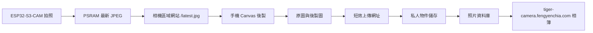

# 從這裡開始

這份文件是 Tiger Camera V1 的唯一開工入口。若其他文件的順序或描述與本頁不同，先以本頁與 [`PROJECT_STATUS.md`](../PROJECT_STATUS.md) 為準，再修正其他文件。

## V1 一句話

ESP32-S3-CAM 負責拍照、螢幕回看及提供最新 JPEG；手機瀏覽器負責 Canvas 後製；`https://tiger-camera.fengyenchia.com` 負責登入後的永久保存、相簿與單次操作直接刪除。

## 系統分成兩層

### 相機區域層

- 網址：`http://192.168.4.1`、`http://camera.local`。
- NFC：固定寫入 `http://192.168.4.1/latest.jpg`。
- 不要求網際網路也能拍照、回看與下載最新照片。
- V1 只在 PSRAM 保存最新一張，關機後消失。

### 雲端相簿層

- 網址：`https://tiger-camera.fengyenchia.com`。
- 需要管理員登入。
- 原圖與後製圖分開保存，後製圖不得覆寫原圖。
- 支援相簿與單次操作直接永久刪除；V1 不設垃圾桶、還原或確認視窗。
- 無網路時不得顯示「已永久保存」；照片先留在瀏覽器待傳佇列或下載到手機。

## 現在從哪裡開始

### Gate C0：先用測試 JPEG 完成雲端閉環

這是目前第一個實作 Gate，先不要等待硬體：

1. 在 `web/` 建立 Next.js 專案。
2. 部署空白網站並連接 `tiger-camera.fengyenchia.com`。
3. 建立私人物件儲存與照片資料表。
4. 建立單一管理員登入；密鑰只放伺服器環境變數。
5. 以檔案選擇器上傳一張測試 JPEG。
6. 顯示相簿縮圖與原圖／後製圖。
7. 完成單次操作直接永久刪除。
8. 驗證未登入者不能列出或讀取照片。

通過條件：一張測試 JPEG 能完成「上傳→顯示→單次永久刪除」，且儲存空間與資料庫沒有孤兒資料。

### Gate H0/H1：再驗證硬體核心

第一批只買 ESP32-S3-CAM＋OV2640、ST7735、快門與必要線材：

1. 記錄實際 PCB、N16R8、OV2640 與螢幕標示。
2. 驗證 TTL／OTG USB-C 的燒錄與序列埠行為。
3. 單獨跑相機範例。
4. 單獨點亮 ST7735。
5. 驗證候選 GPIO 與冷開機。
6. 將最新 JPEG 複製到程式持有的 PSRAM buffer。
7. 驗證相機＋ST7735＋快門＋PSRAM 共存，連續拍攝 30 次。

通過條件：冷開機 10 次、拍攝 30 次，皆無花屏、壞圖、boot failure 或重啟。

### Gate L0：完成區域取圖

1. 建立 WPA2 Wi-Fi AP。
2. 實作 `/status` 與 `/latest.jpg`。
3. 加入防快取 headers，尚無照片時回 404。
4. 將最小區域頁面放在 `firmware/data/`。
5. iPhone 與 Android 測試固定 IP、`camera.local` 與 NFC。

### Gate I0：整合瀏覽器後製與雲端

1. 取得 `/latest.jpg`，保留原始 Blob。
2. Canvas 產生新的後製 Blob。
3. 先把兩份 Blob 放入瀏覽器待傳佇列。
4. 網路可用時向雲端 API 取得短效、限定路徑的上傳網址。
5. 直接上傳原圖與後製圖，再呼叫完成 API。
6. 只有伺服器確認完成後才顯示「已永久保存」。
7. 若公開 HTTPS 頁面無法讀取區域 HTTP 裝置，改用「區域頁面下載→公開網站選檔上傳」備援流程。

### Gate P0/E0：最後才做電池與外殼

- 核心與整合 Gate 通過前，不買 microSD、電池、升壓板或外殼五金。
- 先量工作電流、峰值、溫升與實物尺寸。
- 最後才製作兩片式基本矩形相機殼。

## 文件閱讀順序

1. 本文件：目前唯一開工順序。
2. [`PROJECT_STATUS.md`](../PROJECT_STATUS.md)：最新決策、阻塞與下一個 Gate。
3. [`development-roadmap.md`](development-roadmap.md)：完整階段與完成條件。
4. [`software.md`](software.md)：裝置、網站、API、資料與安全設計。
5. [`hardware.md`](hardware.md)：到貨與接線時使用。
6. [`test-plan.md`](test-plan.md)：每個 Gate 的驗收方法。
7. [`bom.md`](bom.md) 與 [`../bom/tiger-camera-v1.csv`](../bom/tiger-camera-v1.csv)：下單前使用。
8. [`product-plan.md`](product-plan.md)：產品範圍與體驗基準。

## V1 明確不做

- GIF、影片或長按連拍。
- 公開註冊、多使用者社群或自動上傳社群。
- Bluetooth 傳照片、原生手機 App、AI 濾鏡。
- 相機端高解析度後製。
- 老虎造型外殼、喇叭或虎叫音效。
- microSD 裝置端相簿；microSD 保留為未來離線備援。
