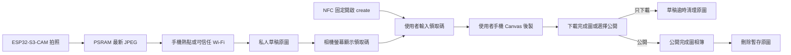

# 從這裡開始

這份文件是 Tiger Camera V1 的唯一開工入口。若其他文件的順序或描述與本頁不同，先以本頁與 [`PROJECT_STATUS.md`](../PROJECT_STATUS.md) 為準，再修正其他文件。

## V1 一句話

ESP32-S3-CAM 負責拍照並透過手機熱點／可信任 Wi-Fi 上傳私人草稿；使用者掃 NFC、輸入螢幕領取碼後，在自己的手機完成 Canvas 後製、下載完成圖或選擇公開；管理員負責永久刪除。

## 系統分成兩層

### 相機與裝置上傳層

- 相機以 Wi-Fi station 模式連接預先設定的 2.4 GHz 手機熱點或可信任 Wi-Fi，不建立使用者 AP。
- 只有相機需要該熱點；領取者以自己的行動網路或一般 Wi-Fi 使用 hosted site。
- ESP32 使用可撤銷、device-scoped credential 建立私人草稿；不持有管理員 JWT、R2 或 Neon 密鑰。
- 原圖上傳並經 Server 確認後，螢幕才顯示 6 位、24 小時有效的配對碼。
- 無網路仍可拍照與回看，但 V1 只在 PSRAM 保留最新一張；未同步時不得顯示領取碼。

### 雲端相簿層

- 網址：`https://tiger-camera.fengyenchia.com`。
- 所有人可瀏覽公開相簿；有效領取碼持有者只能處理與發布該張草稿，管理員才能刪除任意公開照片。
- 原圖只在私人領取與瀏覽器後製期間暫存；公開成功或草稿逾期後刪除，永久保存的只有完成圖。
- 支援相簿與單次操作直接永久刪除；V1 不設垃圾桶、還原或確認視窗。
- NFC 固定寫入 `https://tiger-camera.fengyenchia.com/create`；每張照片的領取碼顯示在相機螢幕，不寫入被動 NFC。
- 未領取草稿逾時後自動刪除；未明確選擇公開的照片不出現在相簿。

## 現在從哪裡開始

### Gate C0：先用測試 JPEG 完成雲端閉環

這是目前第一個 Gate，先不要等待硬體。Frontend／Backend 程式已完成；現在要完成外部服務設定與真實 E2E：

1. 已在 `web/frontend/` 與 `web/backend/` 建立可獨立部署的 Next.js 專案與正式 Route Handlers。
2. 分別部署 Frontend／Backend；Frontend 連接 `tiger-camera.fengyenchia.com`，Backend 連接 `api.tiger-camera.fengyenchia.com`，再設定 API URL 與 CORS 白名單。
3. 建立 Cloudflare R2 私人 bucket、CORS 與 Neon `devices`／`photos` 資料表。
4. 從 `/admin` 建立測試 device credential，模擬裝置上傳原圖並完成 `uploading → ready`。
5. 驗證已實作的 UNIQUE 6 位明碼、24 小時期限、原子單次領取與 draft-scoped UUID Bearer token。
6. 在 `/create` 以真實雲端草稿領取測試 JPEG、後製、下載完成圖並選擇公開。
7. 驗證公開相簿、單一管理員 JWT 與一次永久刪除。
8. 驗證 device、claim holder、公開訪客與管理員四種權限不能互相越權。

通過條件：一張測試 JPEG 能完成「裝置私人上傳→領取碼→手機後製→可選公開→單次永久刪除」，且沒有越權或孤兒資料。

### Gate H0/H1：再驗證硬體核心

第一批只買 ESP32-S3-CAM＋OV2640、ST7735、快門與必要線材：

1. 記錄實際 PCB、N16R8、OV2640 與螢幕標示。
2. 驗證 TTL／OTG USB-C 的燒錄與序列埠行為。
3. 單獨跑相機範例。
4. 單獨點亮 ST7735。
5. 驗證候選 GPIO 與冷開機。
6. 將最新 JPEG 複製到程式持有的 PSRAM buffer。
7. 驗證相機＋ST7735＋快門＋PSRAM 共存，連續拍攝 30 次。

通過條件：冷開機 10 次、拍攝 30 次，皆無花屏、壞圖、boot failure 或重啟。

### Gate L0：完成裝置連網與私人草稿

1. 以忽略版本控制的設定提供 2.4 GHz SSID、密碼與 device credential。
2. 實作 Wi-Fi station 自動重連、上傳 timeout 與指數退避重試。
3. 實作 `device initiate → presigned PUT original → device complete`。
4. Server 確認原圖後建立短效領取碼，ESP32 螢幕顯示「已上傳」與領取碼。
5. 離線或上傳失敗時保留最新 JPEG 並顯示「等待網路」，不得假裝已有領取碼。

### Gate I0：整合瀏覽器後製與雲端

1. 使用者掃機身 NFC，開啟 `https://tiger-camera.fengyenchia.com/create`。
2. 輸入相機螢幕顯示的 6 位領取碼。
3. Server 直接查詢明碼與 24 小時期限，第一次成功領取後清除配對碼並換發單張照片 opaque UUID token。
4. 網站以 claim token 取得私人原圖並在該使用者手機執行 Canvas。
5. 使用者可獨立開關拍立得框、拍攝時間、文字與復古濾鏡；拍攝時間由照片 metadata 自動帶入，不提供手動日期選擇，四項也可全部不選。
6. 使用者可下載完成圖，且不必公開；原圖不提供下載。
7. 若選擇公開，claim token 只能為同一張草稿上傳後製圖並呼叫 publish。
8. Server 確認完成圖與 metadata 完整後才改為 `active` 並顯示「已公開」，接著刪除暫存原圖；失敗時由 cleanup cron 重試。

領取碼是方便配對，不是隱私安全邊界；猜中其他照片是已接受的 V1 取捨。領取者不需要管理員帳號。管理員 JWT 只用於刪除、草稿管理與裝置管理，不交給一般使用者或 ESP32。

### Gate P0/E0：最後才做電池與外殼

- 核心與整合 Gate 通過前，不買 microSD、電池、升壓板或外殼五金。
- 先量工作電流、峰值、溫升與實物尺寸。
- 最後才製作兩片式基本矩形相機殼。

## 文件閱讀順序

1. 本文件：目前唯一開工順序。
2. [`PROJECT_STATUS.md`](../PROJECT_STATUS.md)：最新決策、阻塞與下一個 Gate。
3. [`development-roadmap.md`](development-roadmap.md)：完整階段與完成條件。
4. [`software.md`](software.md)：裝置、網站、API、資料與安全設計。
5. [`hardware.md`](hardware.md)：到貨與接線時使用。
6. [`test-plan.md`](test-plan.md)：每個 Gate 的驗收方法。
7. [`bom.md`](bom.md) 與 [`../bom/tiger-camera-v1.csv`](../bom/tiger-camera-v1.csv)：下單前使用。
8. [`product-plan.md`](product-plan.md)：產品範圍與體驗基準。

## V1 明確不做

- GIF、影片或長按連拍。
- 公開註冊、多使用者社群或自動上傳社群。
- Bluetooth 傳照片、原生手機 App、AI 濾鏡。
- 相機端高解析度後製。
- 老虎造型外殼、喇叭或虎叫音效。
- microSD 裝置端相簿；microSD 保留為未來離線備援。
