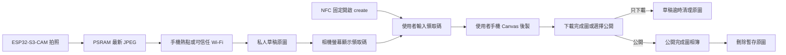

# 從這裡開始

這份文件是 Tiger Camera V1 的唯一開工入口。若其他文件的順序或描述與本頁不同，先以本頁與 [`PROJECT_STATUS.md`](../PROJECT_STATUS.md) 為準，再修正其他文件。

## V1 一句話

ESP32-S3-CAM 負責拍照並透過手機熱點／可信任 Wi-Fi 上傳私人草稿；使用者掃 NFC、輸入螢幕領取碼後，在自己的手機完成 Canvas 後製、下載完成圖或選擇公開；管理員負責永久刪除。

## 系統分成兩層

### 相機與裝置上傳層

- 相機以 Wi-Fi station 模式連接預先設定的 2.4 GHz 手機熱點或可信任 Wi-Fi，不建立使用者 AP。
- 只有相機需要該熱點；領取者以自己的行動網路或一般 Wi-Fi 使用 hosted site。
- ESP32 使用可撤銷、device-scoped credential 建立私人草稿；不持有管理員 JWT、R2 或 Neon 密鑰。
- 原圖上傳並經 Server 確認後，螢幕才顯示 6 位、24 小時有效的配對碼。
- 無網路仍可拍照與回看，但 V1 只在 PSRAM 保留最新一張；未同步時不得顯示領取碼。

### 雲端相簿層

- 網址：`https://tiger-camera.fengyenchia.com`。
- 所有人可瀏覽公開相簿；有效領取碼持有者只能處理與發布該張草稿，管理員才能刪除任意公開照片。
- 原圖只在私人領取與瀏覽器後製期間暫存；公開成功或草稿逾期後刪除，永久保存的只有完成圖。
- 支援相簿與單次操作直接永久刪除；V1 不設垃圾桶、還原或確認視窗。
- NFC 固定寫入 `https://tiger-camera.fengyenchia.com/create`；每張照片的領取碼顯示在相機螢幕，不寫入被動 NFC。
- 未領取草稿逾時後自動刪除；未明確選擇公開的照片不出現在相簿。

## 現在從哪裡開始

### 已完成：Gate C0 測試流程與 Gate H1 硬體核心

Frontend／Backend API 已由使用者完成開發測試；Gate H1 已通過 10 次冷開機
與 30 次連拍。ESP32 已實際連上 production Backend 並完成 Device initiate；
R2 TLS 修正、complete 與完整雲端 E2E 仍需補驗，不能因此把 Gate L0 實機
結果預先標為通過。

### 現在進行：Gate L0 裝置連網與私人草稿

1. 複製 `firmware/tiger-camera-v1/include/secrets.example.h` 為不進 Git 的
   `secrets.h`，填入 2.4 GHz Wi-Fi、device credential 與 HTTPS root CA。
2. 燒錄已實作的 Wi-Fi station、NTP、背景上傳與領取碼版本。
3. 驗證離線仍可拍照、回看與取代最新 JPEG。
4. 驗證熱點恢復後同一 `clientRequestId` 自動完成
   `initiate → presigned PUT → complete`，且不重複建立草稿。
5. 驗證只有 complete 成功才顯示 6 位碼；被撤銷 credential 顯示明確錯誤。
6. 依 [`test-plan.md`](test-plan.md) N-01～N-09 完成 30 次上傳與 5 次斷線恢復。

通過條件：熱點中斷與恢復後能上傳同一張最新照片且不重複，拍照核心不中斷，
只有 Server 確認成功才顯示可用領取碼。

### Gate I0：整合瀏覽器後製與雲端

1. 使用者掃機身 NFC，開啟 `https://tiger-camera.fengyenchia.com/create`。
2. 輸入相機螢幕顯示的 6 位領取碼。
3. Server 直接查詢明碼與 24 小時期限，第一次成功領取後清除配對碼並換發單張照片 opaque UUID token。
4. 網站以 claim token 取得私人原圖並在該使用者手機執行 Canvas。
5. 使用者可獨立開關拍立得框、拍攝時間、文字與復古濾鏡；拍攝時間由照片 metadata 自動帶入，不提供手動日期選擇，四項也可全部不選。
6. 使用者可下載完成圖，且不必公開；原圖不提供下載。
7. 若選擇公開，claim token 只能為同一張草稿上傳後製圖並呼叫 publish。
8. Server 確認完成圖與 metadata 完整後才改為 `active` 並顯示「已公開」，接著刪除暫存原圖；失敗時由 cleanup cron 重試。

領取碼是方便配對，不是隱私安全邊界；猜中其他照片是已接受的 V1 取捨。領取者不需要管理員帳號。管理員 JWT 只用於刪除、草稿管理與裝置管理，不交給一般使用者或 ESP32。

### Gate P0/E0：最後才做電池與外殼

- 核心與整合 Gate 通過前，不買 microSD、電池、升壓板或外殼五金。
- 先量工作電流、峰值、溫升與實物尺寸。
- 最後才製作兩片式基本矩形相機殼。

## 文件閱讀順序

1. 本文件：目前唯一開工順序。
2. [`PROJECT_STATUS.md`](../PROJECT_STATUS.md)：最新決策、阻塞與下一個 Gate。
3. [`development-roadmap.md`](development-roadmap.md)：完整階段與完成條件。
4. [`software.md`](software.md)：裝置、網站、API、資料與安全設計。
5. [`hardware.md`](hardware.md)：到貨與接線時使用。
6. [`test-plan.md`](test-plan.md)：每個 Gate 的驗收方法。
7. [`bom.md`](bom.md) 與 [`../bom/tiger-camera-v1.csv`](../bom/tiger-camera-v1.csv)：下單前使用。
8. [`product-plan.md`](product-plan.md)：產品範圍與體驗基準。

## V1 明確不做

- GIF、影片或長按連拍。
- 公開註冊、多使用者社群或自動上傳社群。
- Bluetooth 傳照片、原生手機 App、AI 濾鏡。
- 相機端高解析度後製。
- 老虎造型外殼、喇叭或虎叫音效。
- microSD 裝置端相簿；microSD 保留為未來離線備援。
