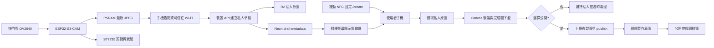

# 軟體、NFC、領取碼、後製與雲端相簿規劃

實作狀態（2026-08-15）：Web Gate C0 的 Frontend、Backend Route Handlers、Neon migration 與 R2 存取層已寫入 repository；真實雲端設定、部署、E2E 與 ESP32 實機串接尚未完成。

## 1. V1 架構



- ESP32-S3-CAM：拍攝、PSRAM 最新 JPEG、螢幕、Wi-Fi station、私人草稿上傳與重試。
- NFC：被動貼紙固定保存 `https://tiger-camera.fengyenchia.com/create`，不保存領取碼或秘密。
- 使用者手機：輸入領取碼、暫時取得該張私人原圖、Canvas 後製、下載完成圖及選擇是否公開。
- Next.js：裝置驗證、領取碼交換、claim token、相簿、管理員驗證與 API。
- Cloudflare R2：暫存私人 original object，永久保存 published finished object。
- Neon：裝置、照片狀態、6 位明碼、opaque UUID token、期限與後製 metadata。

## 2. 網路與憑證

### ESP32 Wi-Fi

- V1 不建立相機 AP、Captive Portal、mDNS 或 `192.168.4.1` 區域網站。
- 相機連接預先設定的 2.4 GHz 手機熱點或可信任 Wi-Fi。
- SSID、密碼與 device credential 放在不進 Git 的韌體 secrets／NVS。
- 手機熱點中斷是正常錯誤：拍照與螢幕回看仍可用，網路恢復後重試最新未同步 JPEG。
- 因 V1 沒有 microSD，只保留最新一張照片；下一次成功拍攝直接取代上一張，不顯示確認視窗。若上一張已有未完成草稿，由 Server 的逾時清理回收。

### 三種權限

| 憑證 | 持有者 | 能做什麼 | 不能做什麼 |
|---|---|---|---|
| Device credential | ESP32 | 建立私人草稿、上傳原圖、完成裝置上傳 | 讀取其他照片、發布、刪除、取得管理員權限 |
| Claim UUID token | 輸入正確配對碼的使用者 | 暫時讀取、後製、下載完成圖及發布該張照片 | 公開原圖、操作其他草稿、管理裝置、永久刪除 |
| Admin JWT | 唯一管理員 | 刪除照片、管理草稿與裝置 | 不放入 ESP32 或公開頁面 |

Device credential 必須可由管理員撤銷。它可以是高熵 opaque token，Server 只保存 hash；不要把 R2、Neon 或管理員密鑰放入韌體。

## 3. 韌體模組

| 模組 | 責任 |
|---|---|
| `CameraService` | 初始化、預覽幀、拍攝 JPEG |
| `LatestPhotoBuffer` | 在 PSRAM 持有最新 JPEG、替換與 mutex 保護 |
| `DisplayService` | 預覽、拍後回看、上傳與領取碼狀態 |
| `ButtonService` | debounce 與短按 |
| `NetworkService` | Wi-Fi station、自動重連、連線狀態 |
| `DraftUploadService` | device initiate、R2 PUT、complete、重試與 idempotency |
| `DeviceCredentialStore` | 從 NVS 讀取 device ID／credential，不寫入 log |
| `AppState` | 狀態機與跨模組事件 |

## 4. 裝置狀態機

| 狀態 | 畫面 | 允許操作 |
|---|---|---|
| `BOOTING` | Logo／初始化 | 無 |
| `CONNECTING` | 連線中 | 仍可進入預覽 |
| `LIVE_VIEW` | 即時預覽＋網路圖示 | 短按拍照 |
| `CAPTURING` | 凍結／快門動畫 | 忽略重複按鍵 |
| `COPYING` | 複製 JPEG 至 PSRAM | 不更新全畫面 |
| `REVIEW` | 剛拍照片，不疊加隨機文字 | 等待上傳 |
| `UPLOAD_PENDING` | 等待網路／可重試 | 新拍攝成功時直接取代最新照片 |
| `UPLOADING` | 上傳中 | 不顯示領取碼 |
| `CLAIM_READY` | 已上傳＋領取碼＋有效時間 | 可回預覽 |
| `ERROR` | 錯誤碼與處置 | 重試／重開 |

只有 Server `complete` 確認原圖 object 存在後，裝置才能顯示領取碼。畫面空間不足時至少顯示大字領取碼、剩餘分鐘與 `已上傳` 狀態，不做 QR Code。

## 5. 最新 JPEG buffer

1. `esp_camera_fb_get()` 取得 JPEG。
2. 在 PSRAM 配置自有 buffer 並複製完整內容。
3. 立刻 `esp_camera_fb_return(fb)`，不得持有已歸還的 framebuffer pointer。
4. 使用 mutex 原子替換 `latestJpeg`、長度與同步狀態。
5. R2 PUT 期間禁止釋放正在傳送的 buffer。
6. 上傳成功後仍可保留到下一次成功拍攝；斷電後消失。

若配置、拍攝或上傳失敗，保留上一張有效照片並顯示錯誤，不得產生領取碼。

## 6. NFC 與領取碼

NFC Tools 寫入：

```text
https://tiger-camera.fengyenchia.com/create
```

NFC 是固定入口。每張照片的領取碼由 Server 產生並顯示於 ST7735，不改寫被動 NFC。

領取碼規則：

- 固定 6 位大寫英數字；V1 可用 UUID 去除連字號後截取前 6 位。
- Server 直接保存明碼，`claim_code` 加 UNIQUE；碰撞時重新產生。
- 有效 24 小時，第一次成功領取後將 `claim_code` 設為 null。
- 領取碼只是配對便利，不是安全邊界；V1 不做 HMAC、claim rate limit 或防猜測。
- 領取成功後產生完整 UUID，保存為 `claim_token`，以 Bearer header 傳送；它不是 JWT。
- UUID token 與 draft ID 綁定、24 小時有效；到期、發布或清理時設為 null。
- 未領取草稿 24 小時後自動移除 original object 與 metadata。

## 7. 手機後製

1. 掃 NFC 開啟 `/create`。
2. 輸入螢幕上的領取碼。
3. `POST /api/drafts/claim` 成功後取得 opaque UUID Bearer token 與私人原圖讀取能力。
4. 原圖只在目前頁面記憶體保留為 `originalBlob`，不得寫入 localStorage 或永久快取；後製完成或頁面離開後釋放。
5. 使用者獨立開關拍立得框、拍攝時間、文字與復古濾鏡，或全部關閉；拍攝時間由照片 `capturedAt` 自動帶入，不提供手動日期選擇器。
6. 文字模式為 `custom`、`default` 或 `none`；保存實際畫出的 `resolvedText`。
7. 有效果時以 Canvas 產生 `processedBlob`；全部關閉時複製原圖 bytes 作為完成圖，仍使用 finished object key。
8. 使用者可以只下載完成圖、不公開；不提供原圖下載，下載也不呼叫 publish API。
9. 選擇公開時，以 claim token 取得 processed presigned PUT URL，完成後呼叫 publish。

Claim token 適合放在記憶體或 `sessionStorage`，不要當成長期登入憑證。清除瀏覽資料可能讓尚未完成的後製狀態消失，因此頁面始終提供下載。

「不提供原圖下載」是產品 UI 與雲端保存政策，不是 DRM。Canvas 後製要求瀏覽器取得原圖 bytes，因此合法領取者仍可能透過開發工具自行保存；安全邊界是未持有該照片 claim token 的人不能取得原圖，且公開 API 永遠不暴露原圖。

## 8. API 合約

| Method | Path | 驗證 | 責任 |
|---|---|---|---|
| `POST` | `/api/device/drafts/initiate` | Device credential | 建立 `uploading` 草稿與 original presigned PUT URL |
| `PUT` | R2 presigned URL | URL 短效簽名 | ESP32 直接上傳 original JPEG |
| `POST` | `/api/device/drafts/:id/complete` | Device credential | `HeadObject` 驗證原圖、改為 `ready`、回傳領取碼 |
| `POST` | `/api/drafts/claim` | 6 位明碼 | 原子消耗配對碼、改為 `claimed`、回傳 draft-scoped UUID token |
| `GET` | `/api/drafts/:id/image` | Claim UUID token | 取得該草稿私人原圖短效讀取 URL |
| `POST` | `/api/drafts/:id/process/initiate` | Claim UUID token | 取得 processed presigned PUT URL |
| `POST` | `/api/drafts/:id/publish` | Claim UUID token | 驗證 finished object 與 metadata，改為 `active`，排程刪除暫存原圖 |
| `GET` | `/api/photos` | 公開 | 分頁列出 `active` 照片 |
| `GET` | `/api/photos/:id/image` | 公開 | 只讀取 active 完成圖 |
| `DELETE` | `/api/photos/:id` | Admin JWT | 單次操作永久刪除完成圖與 metadata |

### 裝置上傳順序

1. 韌體為一次拍攝產生穩定的 `clientRequestId`。
2. `device initiate` 驗證 device credential、JPEG MIME／大小並建立 `uploading`。
3. Server 決定 `drafts/{photoId}/original.jpg`，回傳五分鐘 presigned PUT URL。
4. ESP32 PUT 原圖後呼叫 `device complete`。
5. Server 以 `HeadObject` 確認物件後建立 UNIQUE 6 位明碼與 24 小時期限，將狀態改為 `ready`；重送 complete 可回傳同一個尚未領取的碼。
6. 相同 `clientRequestId` 重試必須回到同一筆草稿，不建立重複照片。

### 領取與發布順序

1. `/api/drafts/claim` 將輸入正規化後直接查詢 `claim_code`，檢查 24 小時期限與 `ready` 狀態。
2. 成功後以 transaction 將 `ready` 改為 `claimed`，使 code 無法再次使用。
3. Server 產生完整 UUID，寫入該 draft 的 `claimToken`／`claimTokenExpiresAt` 並回傳；token 本身不包含 payload。
4. 領取者處理圖片；只有選擇公開時才上傳 processed object。
5. `publish` 以 `HeadObject` 驗證 finished object 與 metadata，再把狀態改為 `active`。
6. 發布成功後刪除 original object 並寫入 `originalDeletedAt`；失敗交由 cleanup cron 進行 idempotent retry。

## 9. 資料模型

### `devices`

| 欄位 | 用途 |
|---|---|
| `id` | 裝置 UUID |
| `name` | 管理員辨識名稱 |
| `credentialHash` | device credential hash |
| `status` | `active`／`revoked` |
| `createdAt`／`lastSeenAt` | 建立與最近連線時間 |

### `photos`

| 欄位 | 用途 |
|---|---|
| `id`／`deviceId` | 照片 UUID 與建立裝置 |
| `clientRequestId` | 裝置重試 idempotency key |
| `originalKey`／`processedKey` | 私人 R2 object keys；original 發布清理後為 null，processed 在發布前可為 null |
| `status` | `uploading`、`ready`、`claimed`、`active`、`deleting` |
| `claimCode`／`claimExpiresAt` | UNIQUE 6 位明碼與 24 小時期限 |
| `claimToken`／`claimTokenExpiresAt` | 領取後的 opaque UUID Bearer token 與期限 |
| `claimedAt`／`publishedAt`／`originalDeletedAt` | 領取、發布與暫存原圖清理時間 |
| `capturedAt`／`createdAt` | 拍攝與資料建立時間 |
| `frameEnabled`／`timestampEnabled` | 後製選項 |
| `textMode`／`resolvedText` | 文字模式與實際內容 |
| `filterPreset`／`processingVersion` | 濾鏡與配方版本 |
| `width`／`height`／大小／MIME | 驗證與顯示 metadata |

## 10. 安全規則

- 不把 device credential、claim token、Admin JWT、R2／Neon secrets 寫入 log、公開 Git 或錯誤 response。
- Admin JWT 仍採使用者指定的 localStorage＋Axios Bearer 模式；維持嚴格 CSP、禁止不可信 HTML，`401` 時清除 token。
- Claim UUID token 只做資料庫 lookup，Admin JWT 才有簽名、audience 與管理員角色；兩者不可互相替代。
- Server 不信任 client 提供的 object key、照片狀態、角色、大小或完成結果。
- 領取碼可能被猜到是已接受取捨；仍不得讓 UUID token 呼叫 Admin API。
- 公開 API 只回傳 `active` 完成圖；`uploading／ready／claimed` 與 original object 一律不可公開。
- 發布後原圖清理與管理員永久刪除都必須 idempotent；部分失敗可由 cron 或 `deleting` 狀態安全重試。

## 11. Repo 實作目錄

```text
firmware/
├── platformio.ini
├── include/
├── src/                 # camera、display、network、draft upload
└── test/

web/
├── frontend/
│   ├── api/             # browser Axios: drafts、photos、auth
│   ├── app/             # home、create、gallery；不含 Route Handlers
│   │   ├── create/_components/  # create 頁面專用元件
│   │   └── gallery/_components/ # gallery 頁面專用元件
│   ├── components/      # Navbar、Footer 與跨頁共用元件
│   ├── components/ui/   # 本地 shadcn-style primitives
│   ├── lib/photo-processing/
│   └── public/
├── backend/
│   ├── app/api/device/  # device credential endpoints
│   ├── app/api/drafts/  # claim、private read、process、publish
│   ├── app/api/photos/  # public gallery、admin delete
│   ├── app/api/docs/    # Swagger UI
│   ├── app/api/openapi/ # OpenAPI 3.0.3 JSON
│   ├── lib/server/      # auth、device auth、claim、Neon、R2
│   └── proxy.ts         # API CORS allowlist／preflight
└── docs/
```

## 12. 實作參考

- [Next.js Route Handlers](https://nextjs.org/docs/app/getting-started/route-handlers)
- [next-swagger-doc](https://github.com/jellydn/next-swagger-doc)
- [Cloudflare R2 Presigned URLs](https://developers.cloudflare.com/r2/api/s3/presigned-urls/)
- [Cloudflare R2 CORS](https://developers.cloudflare.com/r2/buckets/cors/)
- [Neon Serverless Driver](https://neon.com/docs/serverless/serverless-driver)
