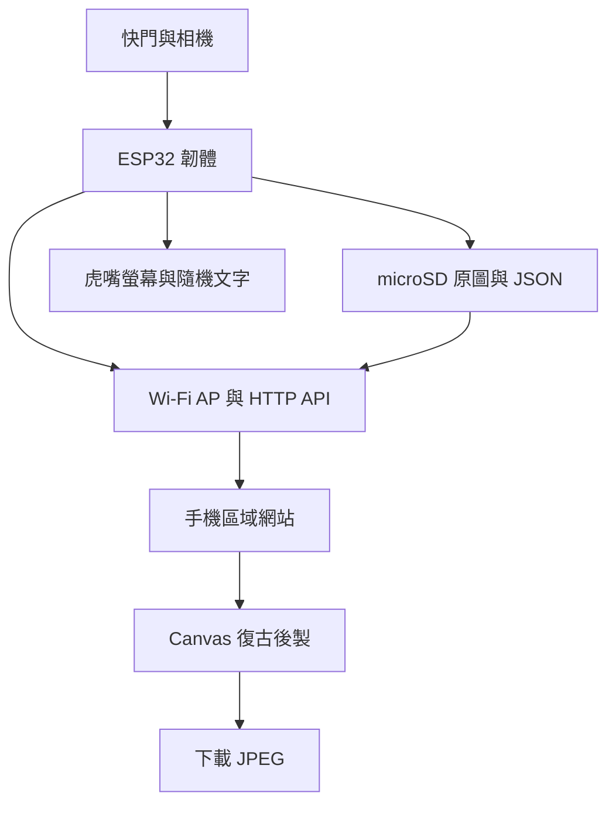

# 軟體、網站與資料規劃

## 1. 整體架構



關鍵分工：

- ESP32：拍攝、原圖保存、縮圖／螢幕預覽、隨機文字、電量、Wi‑Fi、API。
- 手機：高品質色彩與圖層合成、完成 JPEG 匯出。
- 不依賴：App、雲端資料庫、公開伺服器。

## 2. 建議技術選擇

### 2.1 韌體

- 框架：Arduino-ESP32 或 PlatformIO + Arduino framework。
- 建議以 PlatformIO 管理版本、編譯設定與 library lock。
- HTTP：ESPAsyncWebServer 類型方案或 ESP-IDF HTTP server；選型前確認目前 Arduino-ESP32 相容版本。
- JSON：ArduinoJson。
- 顯示：TFT_eSPI 或 LovyanGFX，優先選能明確控制 SPI transaction 的方案。
- 相機：esp32-camera。
- 儲存：SD library，FAT32。

套件版本在實作當天鎖定，不在規劃文件寫死「最新版」。

### 2.2 手機網站

- TypeScript + HTML + CSS。
- 可用 Vite 開發與打包，但輸出必須是 ESP32 可託管的純靜態檔。
- 不建議第一版使用 React／Next.js：頁面少、離線環境、Flash 空間有限，Canvas 與 API 才是核心。
- Canvas 2D 完成濾鏡與圖層。
- 大型資產（框、圖示）先壓縮；透明裝飾用 WebP 或 PNG。
- 網站程式放 Flash；照片留在 microSD，避免互相更新。

## 3. 韌體模組

| 模組 | 責任 |
|---|---|
| CameraService | 初始化、預覽幀、拍攝 JPEG |
| StorageService | 檔名、原圖／JSON 寫入、空間檢查 |
| DisplayService | 預覽、回看、狀態、錯誤、QR |
| CaptureFeedback | 成功文字池、避免連續重複、回看疊字樣式 |
| ButtonService | debounce、短按、保留長按 |
| BatteryService | ADC、平滑、分段百分比、低電量 |
| NetworkService | AP、DNS、mDNS、Captive Portal |
| WebServer | 靜態檔、照片串流、JSON API |
| AppState | 狀態機與跨模組事件 |

## 4. 裝置狀態機

| 狀態 | 畫面 | 允許操作 |
|---|---|---|
| BOOTING | Logo／初始化 | 無 |
| NO_SD | 插入 SD 提示 | 重試 |
| LIVE_VIEW | 即時預覽、電池 | 短按拍照 |
| CAPTURING | 凍結／快門動畫 | 忽略重複按鍵 |
| SAVING | 儲存提示 | 不更新全畫面 |
| REVIEW | 剛拍照片＋隨機成功文字 | 再按回預覽 |
| WIFI_SHARE | SSID／網址／QR | 手機存取 |
| LOW_BATTERY | 小虎沒力提示 | 限制高耗能 |
| ERROR | 錯誤碼與處置 | 重試／重開 |
| SLEEP | 關閉背光／低功耗 | 按鍵喚醒 |

任何錯誤都應回到可預期狀態，不以無限重啟掩蓋問題。

拍照成功文字池固定為：`ROAR!`、`抓到你了！`、`虎視眈眈！`、`今日獵物 +1`、`小虎拍到了！`。只有 JPEG 與 JSON 都成功 rename 後才進入 `REVIEW` 並抽選文字；失敗時進入錯誤畫面，不顯示成功文案。抽選需避免與上一張相同。

## 5. 檔案與目錄

```text
/photos/
├── 20260802/
│   ├── TIGER_000001.JPG
│   ├── TIGER_000001.JSON
│   ├── TIGER_000002.JPG
│   └── TIGER_000002.JSON
└── index.json           # 可重建的快取，不是唯一真相
```

建議中繼資料：

```json
{
  "schemaVersion": 1,
  "id": "TIGER_000001",
  "filename": "TIGER_000001.JPG",
  "capturedAt": "2026-08-02T14:30:25+08:00",
  "capturedAtSource": "phone-sync",
  "width": 1600,
  "height": 1200,
  "effectId": "tiger-film",
  "decorationId": "paw-left",
  "firmwareVersion": "0.1.0",
  "batteryMv": 3860
}
```

寫入安全：

1. 先寫 `.JPG.tmp`。
2. flush／close 成功後 rename 成正式檔。
3. 再寫 JSON temp 並 rename。
4. 開機時清理殘留 temp。
5. 相簿索引損壞時可掃目錄重建。

## 6. API 草案

所有 API 以 `/api/v1` 開頭。

| Method | Path | 用途 |
|---|---|---|
| GET | `/device` | 裝置名稱、版本、電量、SD 空間 |
| POST | `/time` | 手機傳送目前時間與時區 |
| GET | `/photos?cursor=...` | 分頁相簿 |
| GET | `/photos/latest` | 最新照片中繼資料 |
| GET | `/photos/{id}` | 單張中繼資料 |
| GET | `/photos/{id}/original` | 串流原始 JPEG |
| GET | `/photos/{id}/thumb` | 縮圖；V1 可先由原圖降載替代 |
| DELETE | `/photos/{id}` | 刪除；需要管理 PIN／token |
| POST | `/admin/clear` | 清空相簿；二次確認 |

回應範例：

```json
{
  "items": [
    {
      "id": "TIGER_000001",
      "capturedAt": "2026-08-02T14:30:25+08:00",
      "effectId": "tiger-film",
      "originalUrl": "/api/v1/photos/TIGER_000001/original"
    }
  ],
  "nextCursor": null
}
```

約束：

- 照片使用串流回應，不把整張圖複製進 RAM。
- 同時下載數先限制在 1～2。
- 刪除需要伺服器端驗證。
- 錯誤統一回傳 `code`、`message`、`retryable`。

## 7. Captive Portal 與網址

### V1 入口優先順序

1. 手機系統自動開啟的 Captive Portal。
2. `http://tigercam.local`（mDNS）。
3. `http://192.168.4.1`（除錯與保底）。
4. `http://tiger.camera` 僅作可選區域別名，不列為唯一保證。

AP 設定：

- SSID：`TIGER-CAMERA`
- WPA2 密碼：首次燒錄時設定，正式展示不使用 `12345678`
- AP IP：`192.168.4.1`
- 同時連線上限：先設 2～4 台
- 無網際網路是正常狀態，UI 要明確說明

需處理常見偵測路徑，例如 Android、iOS／macOS 與 Windows 的 captive portal probe；實際路徑依實作當時官方行為驗證。

## 8. 手機後製流程

1. 使用 `createImageBitmap` 或 `Image` 解碼 JPEG。
2. 依 EXIF／影像方向修正畫布方向。
3. 將長邊限制在手機可承受的尺寸；原圖過大時避免一次建立多張全尺寸 canvas。
4. 套色彩矩陣或 `ctx.filter`。
5. 疊加暗角與程式生成顆粒。
6. 疊透明裝飾與邊框。
7. 使用固定字型或內嵌可授權字型畫日期。
8. `canvas.toBlob('image/jpeg', 0.9)`。
9. 產生下載，不自動上傳任何地方。

四種效果以資料設定驅動：

```ts
type EffectPreset = {
  id: string
  filter: string
  vignette: number
  grain: number
  frameAsset: string
  decorationAsset?: string
  dateStyle: "dark" | "light" | "red"
}
```

## 9. 時間同步

V1 不買 RTC：

1. 手機每次開啟網站時 POST 本地 ISO 時間、UTC offset。
2. ESP32 保存基準時間與 `millis()`。
3. 當次通電期間據此推進。
4. 從未同步時以序號存檔，`capturedAt` 設 null 或標記 `unsynced`，不可捏造日期。

## 10. 效能與資源預算

- 即時預覽以 240 × 240 顯示需求為主，不在螢幕上解碼最高解析度。
- 拍攝時暫停 preview pipeline，釋放影像 buffer。
- 原圖目標先從 UXGA／較低 JPEG 品質測試，依穩定性調整。
- 成功文字直接編譯進韌體；網頁檔案 gzip／brotli 不一定都適合 ESP32，先評估 gzip 靜態傳送。
- 不把相簿所有中繼資料一次載入；採分頁。
- 網頁首次載入目標小於 500 KB（不含照片）。

## 11. Repo 實作目錄

```text
firmware/
├── platformio.ini
├── include/
├── src/
├── test/
└── data/              # 打包至 Flash 的網頁

web/
├── src/
├── public/
├── tests/
└── dist/              # 產出，不一定進版控

enclosure/
├── cad/
├── exports/
└── dimensions/
```

實作時再加入格式化、單元測試與自動建置，不在規劃階段塞入空的假程式。
