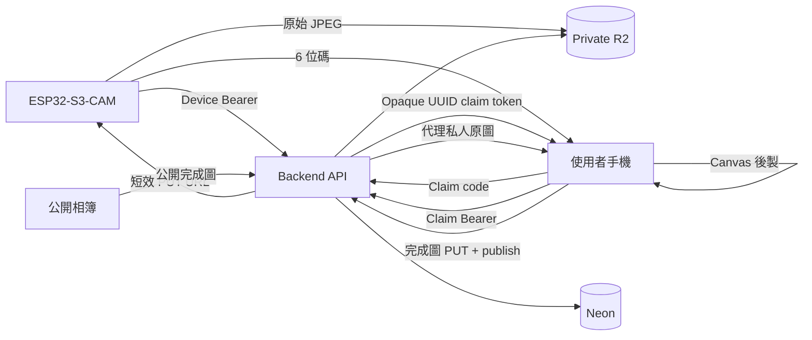

# Software Architecture

## 現況

Gate L0 功能流程已由實機與正式服務跑通：ESP32 拍照後向 Backend initiate、PUT 私人原圖到 R2、complete 後顯示領取碼；手機 claim 後由 Backend 代理原圖，再以 Canvas 後製、下載或發布。

## 系統流程

## 韌體

正式專案位於 `firmware/tiger-camera-v1/`：

- Core 1：相機預覽、快門、JPEG 複製、TFT 狀態。
- Core 0：Wi-Fi、NTP、initiate、R2 PUT、complete、重試。
- framebuffer 在歸還驅動前複製到 owned PSRAM。
- 新一代成功拍攝會使舊 pending upload 失效；request UUID 保持重試冪等。
- Wi-Fi／TLS 失敗不阻塞拍照。
- API 與 R2 使用各自信任根；不使用 `setInsecure()`。

韌體只保存 Wi-Fi 與一次設定、可撤銷的 device credential。現有單一裝置不需每次重新取得 credential；Wi-Fi 連線本身不具有 Backend 驗證能力。R2 key、Neon URL、Admin secret、JWT signing secret 永遠不進韌體或 Serial。

V1 保留 Device Bearer 驗證，因為 API 位於公開網域。管理頁建立裝置只是初次 provision／遺失後輪替工具，不是每次拍照流程。若未來精簡成單一固定 `DEVICE_UPLOAD_TOKEN`，仍必須同時存在 Backend environment 與韌體 secrets，不能開放匿名 initiate／complete。

## Web 邊界

- `web/frontend/`：UI、Axios 呼叫層、claim session、Canvas、下載、相簿與 admin UI。
- `web/backend/`：Next.js Route Handlers、Neon、R2、Device／Claim／Admin auth、cleanup、Swagger。
- Claim token 是資料庫保存 hash 的 opaque UUID，放在 `sessionStorage`。
- Admin JWT 按目前需求放在 `localStorage`，Frontend 主動送 `Authorization: Bearer`；因此必須維持嚴格 XSS 防護。

## API 摘要

| Method | Route | 權限 | 功能 |
| --- | --- | --- | --- |
| POST | `/api/device/drafts/initiate` | Device | 建立草稿與 original PUT URL |
| POST | `/api/device/drafts/:id/complete` | Device | 驗證 R2 object，建立 6 位碼 |
| POST | `/api/drafts/claim` | Public code | 消耗代碼並取得 claim UUID token |
| GET | `/api/drafts/:id/image` | Claim | Backend 驗證後直接代理私人 JPEG |
| POST | `/api/drafts/:id/process/initiate` | Claim | 取得完成圖 PUT URL |
| POST | `/api/drafts/:id/publish` | Claim | 驗證完成圖並選擇是否公開 |
| GET | `/api/photos` | Public | 公開相簿 metadata |
| GET | `/api/photos/:id/image` | Public | 一般檢視 307 到短效完成圖 URL；`?download=1` 由 Backend 回 200 JPEG attachment |
| POST | `/api/admin/login` | Public | 取得 Admin JWT |
| DELETE | `/api/admin/photos/:id` | Admin | 一次永久刪除 metadata 與 object |
| GET | `/api/cron/cleanup` | Cron | 清理逾期草稿與待刪物件 |

## 資料生命週期

1. `uploading`：Backend 建立 draft 與 original key。
2. `ready`：R2 HEAD 驗證完成後產生唯一 6 位碼與 24 小時期限。
3. `claimed`：首次 claim 清除代碼並建立 claim token hash。
4. `processed/private` 或 `published`：完成圖確認後保存 metadata；只有明確公開才出現在相簿。
5. 發布成功或草稿逾期後清除 original；失敗由 cleanup 重試。
6. 管理員刪除是一次永久刪除，不設垃圾桶或二次刪除狀態。

## CORS 與儲存

- Frontend origin 精確使用 `https://tiger-camera.fengyenchia.com`。
- 私人原圖 GET 不依賴 R2 CORS，因為 Backend 直接代理。
- 瀏覽器直傳完成圖時，R2 CORS 只允許正式 Frontend origin、必要 method 與 headers。
- `AllowedOrigins: ["*"]` 可用於短暫診斷，不作正式設定。

## 電池對軟體的影響

P0 初版不新增假電量 UI。若外接供電在上傳峰值造成 brownout，先修正電源容量與接線，不用軟體掩蓋。未來若加入 ADC／fuel gauge，再新增低電量狀態與校正，不影響現有拍照與上傳狀態機。
