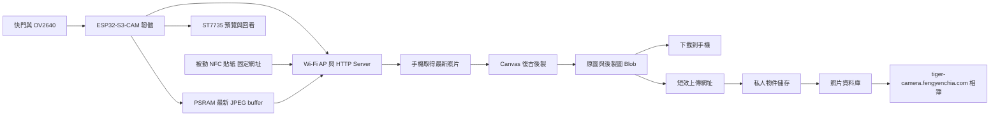

# 軟體、NFC、後製與雲端相簿規劃

## 1. V1 架構



- ESP32-S3-CAM：拍攝、最新 JPEG buffer、螢幕、Wi‑Fi 與 HTTP。
- NFC 貼紙：只保存 URL，不需接線、供電或相機端 NFC 模組。
- 手機：必須先連上相機 Wi‑Fi，再由 NFC 開啟最新照片或網站。
- 相機端不做 microSD、JSON metadata、多照片相簿與重開機保存。
- 公開網站：管理員登入、Canvas 後製、私人物件儲存、metadata、相簿與刪除管理。
- 區域取圖與雲端保存是兩層功能；雲端故障不能阻止拍照與下載到手機。

## 2. 建議技術選擇

- PlatformIO + Arduino-ESP32，實作時鎖定版本。
- 相機：Espressif `esp32-camera`，`PIXFORMAT_JPEG`。
- 顯示：Adafruit_ST7735、TFT_eSPI 或 LovyanGFX；先確認實際模組 offset 與色序。
- HTTP：Arduino `WebServer` 即可；成本版限制單一照片串流，避免複雜並行。
- 相機區域頁面：最小 TypeScript／HTML／CSS 輸出，放在 `firmware/data/` 並打包至 ESP32 Flash。
- 公開網站：`web/` 使用 Next.js App Router，部署於 `https://tiger-camera.fengyenchia.com`。
- Web 架構：V1 維持一個 full-stack Next.js 專案；`web/api/` 是不產生網址的前端 Axios 呼叫層，`web/app/api/` 是產生 `/api/...` 網址的 Route Handlers，`web/lib/server/` 放伺服器專用邏輯，不另拆成兩個部署專案。
- API：Next.js Route Handlers，處理登入驗證、上傳初始化、完成確認、列表與刪除。
- 圖片：私人物件儲存；原圖與後製圖使用不同且不可覆寫的唯一 pathname。
- metadata：PostgreSQL；物件儲存不能取代照片狀態與刪除流程資料庫。
- 上傳：瀏覽器使用短效、限定操作與 pathname 的 URL 直接上傳，長期密鑰只留在伺服器。
- 後製：手機 Canvas 2D，合成復古色調、拍攝日期與拍立得邊框。

## 3. 韌體模組

| 模組 | 責任 |
|---|---|
| CameraService | 初始化、預覽幀、拍攝 JPEG |
| LatestPhotoBuffer | 在 PSRAM 持有最新 JPEG、替換與 mutex 保護 |
| DisplayService | 預覽、回看、隨機文字、狀態與錯誤 |
| ButtonService | debounce 與短按 |
| NetworkService | AP、DNS、mDNS 與 Captive Portal |
| WebServer | 靜態頁、`/latest.jpg` 與裝置狀態 |
| CaptureFeedback | 五句文字、避免連續重複與回看疊字 |
| AppState | 狀態機與跨模組事件 |

## 4. 裝置狀態機

| 狀態 | 畫面 | 允許操作 |
|---|---|---|
| BOOTING | Logo／初始化 | 無 |
| LIVE_VIEW | 即時預覽 | 短按拍照 |
| CAPTURING | 凍結／快門動畫 | 忽略重複按鍵 |
| COPYING | 複製 JPEG 至 PSRAM | 不更新全畫面 |
| REVIEW | 剛拍照片＋隨機文字 | 再按回預覽 |
| WIFI_SHARE | SSID／網址 | 手機存取 |
| NO_PHOTO | 尚未拍照提示 | 回預覽／拍照 |
| ERROR | 錯誤碼與處置 | 重試／重開 |

只有 JPEG 完整複製到程式持有的 PSRAM buffer 後才進入 `REVIEW`。文字池固定為：`ROAR!`、`抓到你了！`、`虎視眈眈！`、`今日獵物 +1`、`小虎拍到了！`，並避免與上一張相同。

## 5. 最新 JPEG buffer 規則

相機 driver 的 framebuffer 必須歸還，不能把 `fb->buf` 指標當成永久照片：

1. `esp_camera_fb_get()` 取得 JPEG。
2. 先在 PSRAM 配置相同長度的自有 buffer。
3. 複製 `fb->buf` 後立刻 `esp_camera_fb_return(fb)`。
4. 使用 mutex 原子替換 `latestJpeg` 與 `latestJpegLen`。
5. HTTP 傳送期間禁止替換或釋放正在使用的 buffer。
6. 下一張成功照片覆蓋上一張；重新開機後為空。

若 PSRAM 配置失敗，保留上一張有效照片並顯示拍攝失敗，不可留下半張圖片。

## 6. NFC 固定網址

### 6.1 正確網址

ESP32 軟體 AP 的常用預設 IP 是完整的四段地址：

```text
http://192.168.4.1/latest.jpg
```

`http://192.168.4` 不是完整 IPv4 位址。也可另提供 `http://camera.local/latest.jpg`，但固定 IP 對不同手機通常更直接。

### 6.2 使用 NFC Tools 寫入

1. 準備一張未鎖定的 NTAG213 或 NTAG215 被動式 NFC 貼紙；此短網址用 NTAG213 即足夠。
2. 手機安裝並開啟 NFC Tools。
3. 選擇「寫入」→「新增記錄」→「自訂 URL／URI」。
4. 輸入 `http://192.168.4.1/latest.jpg`。
5. 返回後按「寫入」，將手機 NFC 感應區貼近標籤，直到 App 顯示成功。
6. 先讓測試手機連上相機的 Wi‑Fi AP，再感應貼紙並開啟通知中的網址。
7. 拍一張新照片後再次感應，確認瀏覽器顯示新圖。

注意：NFC URL 不會自動連接相機 Wi‑Fi，也不會儲存照片。iPhone／Android 可能先顯示通知，使用者仍需點擊；展示時應在機身或說明卡印出 SSID 與連線步驟。

## 7. Arduino WebServer handler

以下是規劃用的最小處理方式。`latestJpeg` 必須是複製到 PSRAM、由程式持有的記憶體，不能是已歸還給相機 driver 的 framebuffer。

```cpp
#include <WebServer.h>
#include <WiFi.h>
#include "esp_camera.h"
#include "esp_heap_caps.h"
#include "freertos/FreeRTOS.h"
#include "freertos/semphr.h"

WebServer server(80);

uint8_t* latestJpeg = nullptr;
size_t latestJpegLen = 0;
SemaphoreHandle_t latestJpegMutex;

bool replaceLatestJpeg(const uint8_t* source, size_t length) {
  auto* next = static_cast<uint8_t*>(
      heap_caps_malloc(length, MALLOC_CAP_SPIRAM | MALLOC_CAP_8BIT));
  if (next == nullptr) return false;

  memcpy(next, source, length);

  if (xSemaphoreTake(latestJpegMutex, pdMS_TO_TICKS(1000)) != pdTRUE) {
    heap_caps_free(next);
    return false;
  }

  uint8_t* previous = latestJpeg;
  latestJpeg = next;
  latestJpegLen = length;
  xSemaphoreGive(latestJpegMutex);

  if (previous != nullptr) heap_caps_free(previous);
  return true;
}

bool captureLatestJpeg() {
  camera_fb_t* fb = esp_camera_fb_get();
  if (fb == nullptr || fb->format != PIXFORMAT_JPEG) {
    if (fb != nullptr) esp_camera_fb_return(fb);
    return false;
  }

  const bool copied = replaceLatestJpeg(fb->buf, fb->len);
  esp_camera_fb_return(fb);
  return copied;
}

void handleLatestJpeg() {
  if (xSemaphoreTake(latestJpegMutex, pdMS_TO_TICKS(1000)) != pdTRUE) {
    server.send(503, "text/plain; charset=utf-8", "Camera busy");
    return;
  }

  if (latestJpeg == nullptr || latestJpegLen == 0) {
    xSemaphoreGive(latestJpegMutex);
    server.sendHeader("Cache-Control", "no-cache, no-store, must-revalidate");
    server.send(404, "text/plain; charset=utf-8", "尚未拍照");
    return;
  }

  server.sendHeader("Cache-Control", "no-cache, no-store, must-revalidate");
  server.sendHeader("Pragma", "no-cache");
  server.sendHeader("Expires", "0");
  server.setContentLength(latestJpegLen);
  server.send(200, "image/jpeg", "");

  WiFiClient client = server.client();
  size_t offset = 0;
  while (offset < latestJpegLen && client.connected()) {
    const size_t written = client.write(latestJpeg + offset,
                                        latestJpegLen - offset);
    if (written == 0) break;
    offset += written;
  }

  xSemaphoreGive(latestJpegMutex);
}

void setupWebServer() {
  latestJpegMutex = xSemaphoreCreateMutex();
  server.on("/latest.jpg", HTTP_GET, handleLatestJpeg);
  server.begin();
}
```

成本版先限制同時一個照片下載。正式實作時需處理 mutex 建立失敗、client timeout、部分傳送、相機初始化失敗及 PSRAM 不存在等情況。

## 8. 網路入口

1. NFC：`http://192.168.4.1/latest.jpg`
2. Captive Portal 首頁。
3. `http://camera.local`（mDNS）。
4. `http://192.168.4.1`（備援首頁）。

AP 使用 WPA2。無網際網路是正常狀態，UI 必須清楚說明。Wi‑Fi 啟動失敗不能阻止相機拍照與螢幕回看。

## 9. 手機後製與待傳佇列

1. 下載 `/latest.jpg`。
2. 將原始回應保留為 `originalBlob`，不得因後製而覆寫。
3. 依影像方向修正 Canvas。
4. 套用復古色調、暗角與顆粒，再合成拍攝日期及拍立得邊框。
5. `canvas.toBlob('image/jpeg', 0.9)` 產生新的 `processedBlob`。
6. 將兩份 Blob、暫存 ID、建立時間與後製參數寫入 IndexedDB 待傳佇列。
7. 使用者可隨時下載原圖或後製圖；不回寫相機。
8. 網路可用且已登入時啟動雲端上傳；API 完成前狀態只能是「待上傳」或「上傳中」。

IndexedDB 只是斷網與切換 Wi-Fi 的暫存，不是永久備份。頁面必須提供「下載到手機」與「重新上傳」；清除瀏覽器資料可能移除待傳照片。

## 10. 區域相機與公開網站的整合策略

### 10.1 優先流程

1. 使用者先登入並開啟 `https://tiger-camera.fengyenchia.com/capture`。
2. 手機連上相機 AP 後，公開頁面嘗試讀取 `http://192.168.4.1/latest.jpg`。
3. 支援的瀏覽器要求 Local Network Access 權限；ESP32 必須回應限定來源的 CORS headers。
4. 取得照片後立即進入 IndexedDB，使用者可切回有網際網路的連線再上傳。

公開 HTTPS 頁面讀取區域 HTTP IP 受瀏覽器的 Local Network Access、mixed-content、CORS 與手機保留行動數據策略影響，不能當作唯一可用流程。

### 10.2 必做備援

1. 相機區域頁面提供「下載原圖」。
2. 公開網站提供「從手機選擇照片」。
3. 使用者離開相機 AP、恢復網路後，從手機選取 JPEG。
4. 公開網站再執行 Canvas 後製與上傳。

此備援不依賴跨來源讀取私有 IP，是 iPhone／Android 都必須驗收的 V1 流程。

## 11. 雲端照片生命週期與 API

### 11.1 API 合約

| Method | Path | 責任 |
|---|---|---|
| `POST` | `/api/photos/initiate` | 驗證登入、限制 MIME／大小，建立照片 ID 與兩個短效上傳網址 |
| `PUT` | 短效 URL | 瀏覽器直接上傳原圖或後製圖，不經應用伺服器轉送檔案 |
| `POST` | `/api/photos/:id/complete` | 以儲存服務 `head` 驗證兩個物件後，將照片改為 `active` |
| `GET` | `/api/photos` | 分頁列出管理員可見的 `active` 照片 |
| `GET` | `/api/photos/:id/image?variant=original|processed` | 驗證登入後串流圖片或回傳短效讀取網址 |
| `DELETE` | `/api/photos/:id` | 單次刪除操作後直接永久刪除兩個物件與 metadata |

所有 API 都必須驗證管理員 session。`initiate` 只能簽發指定照片 ID、variant、MIME、大小與短有效期的上傳能力，不得把整個儲存空間的讀寫密鑰送到瀏覽器。

### 11.2 上傳順序

1. Client 產生一個 `clientRequestId`，避免重試建立重複照片。
2. `initiate` 建立 `uploading` 記錄及唯一 pathname，例如 `photos/{photoId}/original.jpg` 與 `photos/{photoId}/processed.jpg`。
3. Client 分別 `PUT` 兩份 Blob。
4. Client 呼叫 `complete`。
5. Server 驗證 pathname、content type、size 與兩個物件均存在，再改成 `active`。
6. 若任一步驟失敗，Client 保留待傳項目；Server 可清理超時停在 `uploading` 的物件與記錄。

### 11.3 刪除順序

1. 使用者按一次刪除，Client 立即呼叫 API 並顯示處理中狀態；不顯示確認視窗。
2. Server 把狀態改為 `deleting`，避免仍出現在相簿。
3. 刪除原圖與後製圖。
4. 兩個物件都不存在後才刪除 metadata，或留下最小 tombstone 供稽核。
5. 部分失敗時保留 `deleting`，讓背景工作或管理員重試；不得靜默留下孤兒物件。

## 12. 資料模型

`photos` 最小欄位：

| 欄位 | 用途 |
|---|---|
| `id` | UUID 主鍵，也是物件路徑的一部分 |
| `clientRequestId` | 上傳重試的 idempotency key，必須唯一 |
| `originalPath`／`processedPath` | 兩個私人物件路徑 |
| `status` | `uploading`、`active`、`deleting` |
| `createdAt`／`completedAt` | 建立與完成時間 |
| `filterPreset` | 使用的效果名稱與版本 |
| `width`／`height` | 輸出尺寸 |
| `originalSize`／`processedSize` | 上傳大小與限制檢查 |
| `mimeType` | V1 僅接受 `image/jpeg` |

V1 只有一個管理員，因此可以先不建立公開使用者註冊；但資料表與 API 不應用檔名推定授權。

## 13. 安全與錯誤規則

- 管理員登入使用安全、HttpOnly、Secure session cookie；密碼雜湊或外部登入設定只放伺服器。
- 允許的圖片類型只限 JPEG，並限制單檔大小、像素與請求頻率。
- 不信任 client 傳入的 pathname、狀態、擁有者或完成結果；Server 必須重新驗證。
- CORS 只允許實際需要的來源、method 與 headers，不使用帶 credentials 的萬用 `*`。
- 公開 Git、ESP32 韌體與瀏覽器 bundle 不得包含資料庫 URL、管理員密碼或長期儲存 token。
- 任何上傳、讀取或刪除失敗都要回傳可辨識錯誤碼，UI 提供重試，不把錯誤當成功。

## 14. Repo 實作目錄

```text
firmware/
├── platformio.ini
├── include/
├── src/
├── test/
└── data/              # 打包至 Flash 的最小區域取圖頁面

web/
├── app/
│   ├── api/           # auth、photos 與上傳生命週期
│   ├── capture/       # 取圖、Canvas 與待傳佇列
│   └── gallery/       # active 相簿與單次操作直接刪除
├── lib/               # auth、database、storage、validation
├── public/
├── tests/
└── migrations/

enclosure/
├── cad/
├── exports/
└── dimensions/
```

## 15. 實作參考

- [Next.js Route Handlers](https://nextjs.org/docs/app/getting-started/route-handlers)
- [Vercel 自訂網域設定](https://vercel.com/docs/domains/set-up-custom-domain)
- [Vercel Blob Private Storage](https://vercel.com/docs/vercel-blob/private-storage)
- [Vercel Blob Client Uploads](https://vercel.com/docs/vercel-blob/client-upload)
- [Vercel Blob Signed URLs](https://vercel.com/changelog/signed-urls-are-now-available-for-vercel-blob)
- [MDN Local Network Access](https://developer.mozilla.org/en-US/docs/Web/Security/Defenses/Local_network_access)
