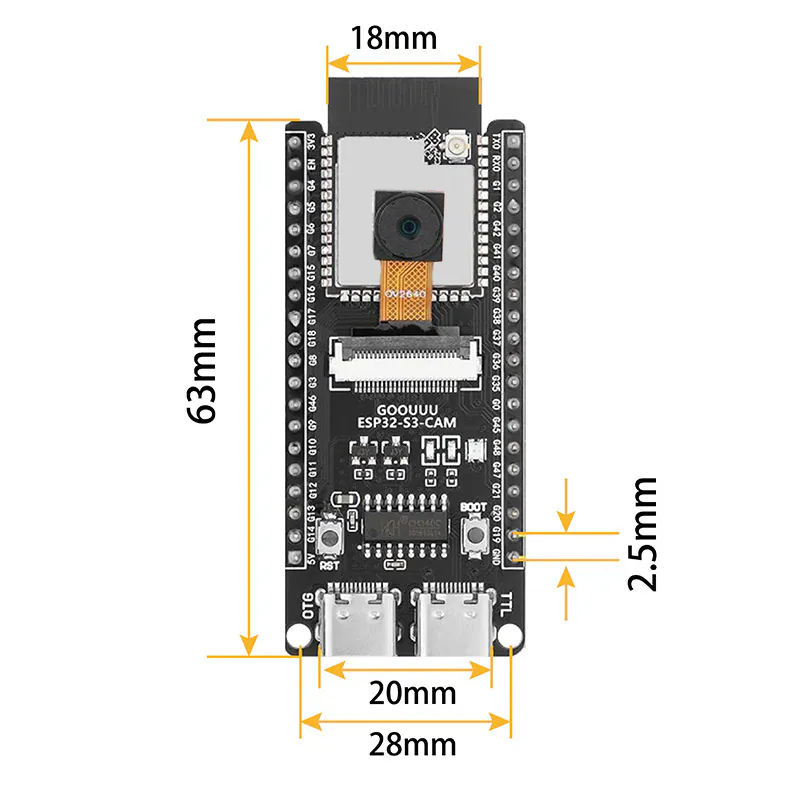
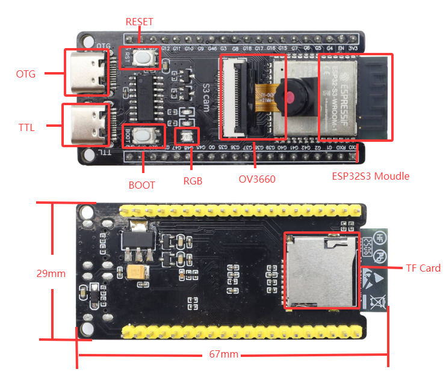
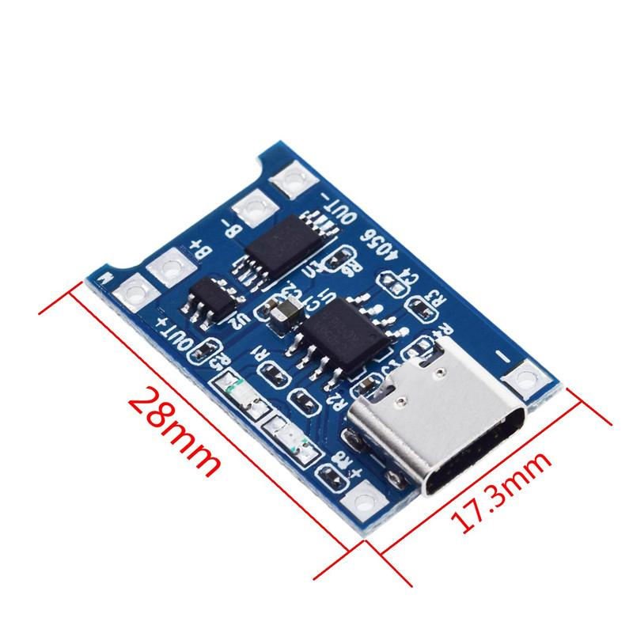
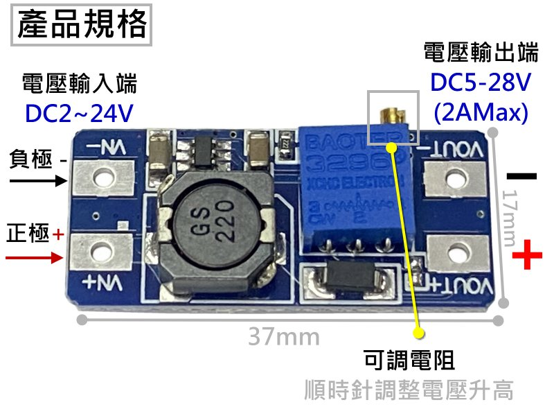

# E0 外殼尺寸量測表

這份表是 Tiger Camera 第一版外殼的唯一尺寸來源。數字一律以 `mm` 填寫，建議卡尺讀到 `0.1 mm`；工程圖可先填入「暫定值」，但實物量測優先。

## 填寫規則

- `實測／工程圖數值`：填實際數字，例如 `46.5 × 30.0 × 4.2`。
- `來源`：填「實測」、工程圖網址、或檔名；不可只寫「蝦皮圖片」。
- `狀態`：填 `待量`、`暫定` 或 `已確認`。
- 相機板的座標以**鏡頭朝你**、PCB 左下角為 `(0, 0)`；螢幕板的座標以**螢幕朝你**、PCB 左下角為 `(0, 0)`。兩者各自填入開孔／可視區偏移，避免因兩面相對而鏡像誤植。
- 所有「最大高度」均包含排針、焊點、線材、熱縮管或突出的旋鈕／接頭。

## A. ESP32-S3-CAM 與鏡頭

| ID | 要量的項目 | 暫定值 | 實測／工程圖數值 | 來源 | 狀態 |
| --- | --- | --- | --- | --- | --- |
| A-01 | PCB 長 × 寬 × 厚 | `67.0 × 29.0 × 30.0` |  |  | 待量 |
| A-02 | 正面最高高度（不含鏡頭） | `4.0` |  |  | 待量 |
| A-03 | 背面最高高度／焊點 | `17`(含排針) |  |  | 待量 |
| A-04 | 鏡頭中心 `X, Y` | `15, 50` |  |  | 待量 |
| A-05 | 鏡頭外徑 | `Ø8.0` |  |  | 暫定 |
| A-06 | 鏡頭突出 PCB 高度 | `7.0` |  |  | 暫定 |
| A-07 | 鏡頭周圍不被殼遮住的最小圓孔／淨空 | `Ø9.0`（設計孔徑） |  | 鏡頭 `Ø8.0` 加 `0.5 mm` 徑向淨空 | 待測試片 |
| A-08 | ESP32 兩個 USB-C 的實物外形 | 實物開口 `9.0 × 3.0`；僅作後蓋拆開後燒錄／維修時的內部操作參考 |  | **不做外殼開孔** | 已決定 |
| A-09 | ESP32 兩個 USB-C 的位置與端口間距 | 第一個 USB：`9.5, 3.0`；第二個 USB：`20.5, 3.0`；ESP32 可向上移，底面不需與端口貼合 |  | 保留插線與拆後蓋維修空間，不可被電池或 MT3608 擋住 | 已決定 |
| A-10 | USB-C 插頭插入方向需要的內部維修淨空 | `USB-C 插頭長寬：6.0 × 12.0`；端口前方預留至少 `10–15 mm` 可操作空間 |  | 只在後蓋拆開後使用 | 已決定 |
| A-11 | 固定孔直徑、孔中心 `X, Y`；若無孔，記錄可夾持板邊 | `2.0, 2.0`；`26.0, 2.0` |  |  | 待量 |
| A-12 | ESP32 天線區域外框與禁放區 | `長寬：7.0 X 18.0` |  |  | 待量 |

## B. ST7735 螢幕

| ID | 要量的項目 | 暫定值 | 實測／工程圖數值 | 來源 | 狀態 |
| --- | --- | --- | --- | --- | --- |
| B-01 | PCB 長 × 寬 × 厚 | `46.5 × 30.0 × 4.0` | CAD 草圖 3：後蓋上以直式 `30.0 × 46.5 mm` 外框定位 | Onshape 草圖 3 | 已建模 |
| B-02 | 含排針／焊線的最大總深度 | `22.0` |  |  | 暫定 |
| B-03 | 可視區寬 × 高 | `28.0 × 30.0` | CAD 草圖 3：`28.0 × 30.0 mm` | Onshape 草圖 3 | 已建模 |
| B-04 | 可視區相對 PCB 左／下邊偏移 | `可視區左下角距離PCB左下角X,Y：1.0, 11.5` | CAD 草圖 3 目前沿用此偏移 | Onshape 草圖 3 | 已建模 |
| B-05 | 螢幕正面玻璃／框高度 | `2.0` |  |  | 待量 |
| B-06 | 固定孔直徑與孔中心；若無孔，記錄可壓住的 PCB 邊 | `質精：Ø2.0`；`四角皆有孔，距離各自四角都是 2.0   x 2.0` |  |  | 待量 |
| B-07 | 排針／導線出口位置與彎線深度 | `所有排針皆在背面，深度 17`；`彎線深度 27(但可以再調整或留多一點空間)` |  |  | 待量 |
| B-08 | 螢幕外框相對後蓋左／下邊定位 | `30.0, 30.0` | CAD 草圖 3：PCB 外框左下角距後蓋左、下邊各 `30.0 mm` | Onshape 草圖 3 | 已建模 |

## C. 電池與電源模組

| ID | 要量的項目 | 暫定值 | 實測／工程圖數值 | 來源 | 狀態 |
| --- | --- | --- | --- | --- | --- |
| C-01 | 803040 電池本體長 × 寬 × 厚 | `40.0 × 30.0 × 8.0` |  |  | 暫定 |
| C-02 | 電池含保護板、膠帶、導線出口的最大包絡尺寸 | `46.0 x 31.0 x 8.0` |  |  | 待量 |
| C-03 | 電池導線出口位置、線長與彎線空間 | `導線出口位置距離充電模組線長約 35` |  |  | 待量 |
| C-04 | TP4056 PCB 長 × 寬 × 最大高度 | `29.0 x 17.0 x 5.0` |  |  | 待量 |
| C-05 | TP4056 USB-C 開孔寬 × 高、中心位置 | 右側面、緊鄰 KCD1-11、**直式方向** | CAD 草圖 4：側面開孔 `3.0 × 7.5 mm`；其下緣比 KCD1-11 開孔下緣高 `4.45 mm`。實體插頭實測前仍屬定位原型 | Onshape 草圖 4 | 已建模 |
| C-06 | TP4056 CHARGE／DONE LED 中心位置、直徑與觀察孔需求 | `LED 中心距離外側高 7.5`；**不設外殼觀察孔**，充電時拆後蓋查看 |  |  | 已決定 |
| C-07 | TP4056 焊線出口與熱縮管最大高度 | `焊線出口在usb的另一側，熱縮館高度20.0` |  |  | 待量 |
| C-08 | MT3608 PCB 長 × 寬 × 最大高度（含電感） | `39.0 x 18.0 x 7.0` |  |  | 待量 |
| C-09 | MT3608 電位器位置與最高高度 | `高度 5.5` |  |  | 待量 |
| C-10 | MT3608 焊線出口與熱縮管最大高度 | `焊線出口在in+/in-的那一端 `；`熱縮管最大高度：24.0` | |  | 待量 |
| C-11 | KCD1-11 面板法蘭寬 × 高 | `16.0 x 11.0` |  |  | 待量 |
| C-12 | KCD1-11 真正開孔寬 × 高、適用板厚 | 實物開口待測試片 | CAD 草圖 4：目前開孔 `11.0 × 16.0 mm`；左緣距側面基準 `11.5 mm`，下緣距底部基準 `48.5 mm` | Onshape 草圖 4；列印前仍須實測 | 已建模、待實測 |
| C-13 | KCD1-11 後方本體與端子＋線材總深度 | `30.0` |  |  | 待量 |
| C-14 | 電池艙設計內淨空（不壓縮電池） | 至少 `48.0 × 33.0 × 10.0` | 以 C-02 最大包絡 `46.0 × 31.0 × 8.0` 各方向留至少 `1.0 mm` 餘裕 | 已決定 |

## D. 外部互動元件

| ID | 要量的項目 | 暫定值 | 實測／工程圖數值 | 來源 | 狀態 |
| --- | --- | --- | --- | --- | --- |
| D-01 | 快門 `060009` 螺牙外徑／需要圓孔直徑 | `Ø12.0` |  |  | 待量 |
| D-02 | 快門按帽外徑、前方突出高度 | `快門按帽外徑：18.5`；`前方突出高度：9.5` |  |  | 待量 |
| D-03 | 快門後方本體直徑、深度、端子＋焊線深度 | `直徑：12.0；深度：29.0`；`端子＋焊線深度：20.0` |  |  | 待量 |
| D-04 | 快門螺帽厚度與適用面板厚度 | `螺帽厚度：2.0；適用面板厚度未定，但可旋緊深度是 9.0` |  |  | 待量 |
| D-05 | NFC 貼紙外形長 × 寬／直徑、厚度 | `25.0 x 25.0 (正方形)，厚度不到1` |  |  | 待量 |
| D-06 | NFC 預定貼附位置與其背面淨空區 | `暫無明確位置` |  |  | 待量 |

## E. 組裝與列印公差

| ID | 要量或決定的項目 | 實測／決定值 | 來源／備註 | 狀態 |
| --- | --- | --- | --- | --- |
| E-01 | 線束最粗處直徑、共地焊點與熱縮管尺寸 | `熱縮管直徑：3.0` |  | 待量 |
| E-02 | 線束所需最小彎曲深度 | `約 44.0` |  | 待量 |
| E-03 | M2 熱熔螺母實物外徑 × 長度 |  |  | 待量 |
| E-04 | M2 螺絲柱位置與需要高度 |  |  | 待量 |
| E-05 | 列印機孔徑測試：圓孔／矩形孔各自補償值 | 以 CAD 基準先印：TP4056 `3.0 × 7.5`、KCD1-11 `11.0 × 16.0`；各再做 `+0.2 mm` 版本 | 先印測試片，選出插拔與固定都合適的尺寸 | 待測試片 |
| E-06 | 外殼壁厚、內部組裝淨空與電池膨脹空間 | 電池艙內淨空至少 `48.0 × 33.0 × 10.0`；壁厚待平面佈局決定 | 電池不壓緊，避開螺絲柱與銳角 | 部分已決定 |
| E-07 | 前後蓋螺絲數量、位置與開合方向 |  | 從背面拆修 | 待定 |
| E-08 | 面向定義 |  | 前面＝鏡頭朝外；背面＝螢幕朝使用者；頂面＝快門 | 已確認 |
| E-09 | 第一版前後蓋定位原型外徑（寬 × 高 × 厚） | `90.0 × 105.0 × 50.0`；壁厚 `2.5`；內部包絡約 `85.0 × 100.0 × 45.0` | 2026-08-29 已同步至 Onshape；高度先縮短 `20.0 mm`，寬度保留給電池與電源模組，通過實裝後再評估縮到約 `80 mm` | 已建模 |

## 建模前的最小完成條件

至少完成 A-01、A-04～A-12、B-01～B-07、C-01～C-13、D-01～D-06、E-01～E-05，才開始最終平面佈局。可先用暫定外形做紙板或 3D 列印定位板，但不可直接據此輸出最終功能殼。
