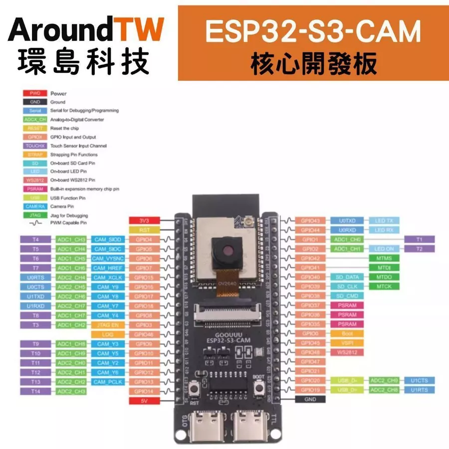
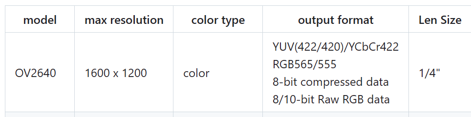
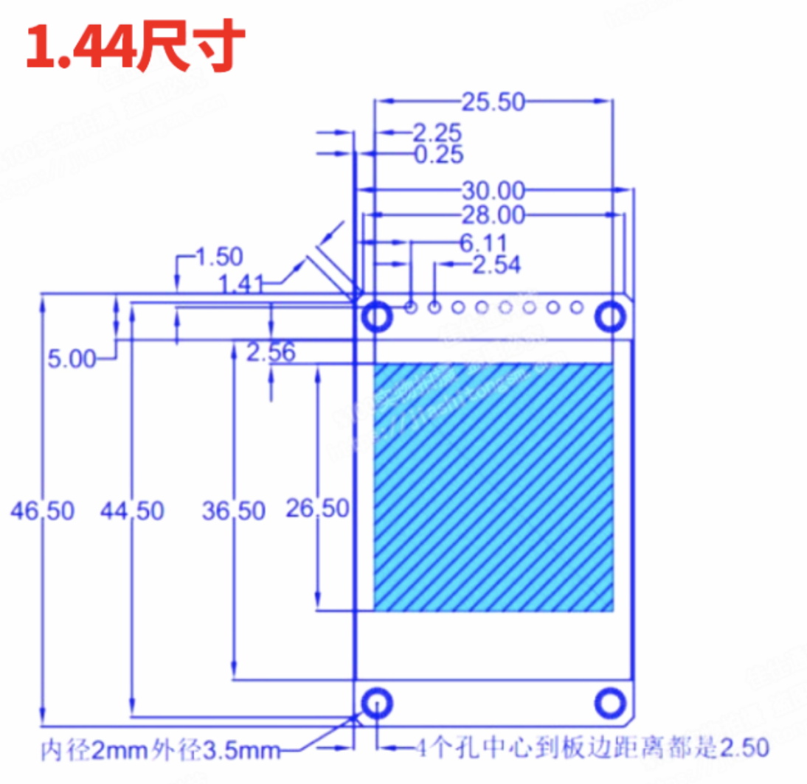

# Firmware

此目錄保留給 AroundTW／GOOUUU ESP32-S3-CAM N16R8＋OV2640 V1 韌體。

開始實作前先完成：

1. 記錄實際 PCB、ESP32-S3-WROOM-1-N16R8 與 OV2640 標示。

---
 [Wi-Fi + Bluetooth 5 (LE)]

集成 2.4 GHz Wi-Fi (802.11 b/g/n)，支援 40 MHz ；其低功耗藍牙系統支持 Bluetooth 5 (LE) 和 Bluetooth Mesh，可通過 Coded PHY 與廣播擴展實現遠距離通訊。

 

[豐富的 IO 接口]

擁有 45 個可編程 GPIO 以及 SPI、I2S、I2C、PWM、RMT、ADC、UART、SD/MMC 主機控制器和 TWAITM 控制器等常用外設接口。

 

[成熟的軟體支援]

ESP32-S3 沿用樂鑫成熟的物聯網開發框架 ESP-IDF。 ESP-IDF 已成功賦與了數已億計物聯網設備，歷經了嚴格的測試和發布週期，具有清晰有效的支持策略。

 

[支持 AI 加速]

ESP32-S3 增加了用於加速神經網絡計算和訊號處理等工作的向量指令 (vector instructions)。 AI 開發者們通過 ESP-DSP 和 ESP-NN 庫使用這些向量指令，可以實現高性能的圖像識別、語音喚醒和識別等應用。 ESP-WHO 和 ESP-Skainet 也將支持此功能。

 

【產品規格】

[CPU 、Memory和硬體規格]

========== 硬體記憶體規格檢查 ==========
晶片型號: ESP32-S3 (Rev 2)
CPU 核心數: 2, 時脈: 240 MHz
實際 Flash 容量: 16777216 bytes (約 16 MB)
PSRAM 狀態: 成功啟用
實際 PSRAM 容量: 8388608 bytes (約 8 MB)
可用 PSRAM 容量: 8384788 bytes
可用內部 Heap: 359080 bytes
========================================

📌振盪器：40Mhz CryStal

📌工作電壓：3.0V~3.6V

📌模組接口：具有45個GPIO，SPI、LCD、Camera接口、UART、I2C、I2S、 红外線遥控、脈衝計數器、PWM、USB1.1OTG、 USB Serial/JTAG 控制器、MCPWM、SDIO 主機接 口、GDMA、TWAI® 控制器(兼容 ISO 11898-1)、 ADC、觸摸傳感器、溫度傳感器、定時器和看門狗。

📌USB OTG：還有一個全速 USB 1.1 On-The-Go (OTG) 接口用於 USB 通訊。

 

[WIF規格]

📌協議：802.11 b/g/n(802.11n，速度高達 150 Mbps)

📌工作中心頻率：2412 ~ 2484 MHz 

 

[藍芽規格]

📌低功耗藍牙(BluetoothLE):Bluetooth5、Bluetooth mesh

📌速率支持 125 Kbps、500 Kbps、1 Mbps、2 Mbps

📌廣播擴展 (Advertising Extensions)

📌多廣播 (Multiple Advertisement Sets)

---

|model|max resolution|color type|output format|Len Size|
|-------|------|-----|----|----|
|OV2640|1600 x 1200|color|YUV(422/420)/YCbCr422 ,RGB565/555 ,8-bit compressed data ,8/10-bit Raw RGB data|1/4"|

---

【 1.44吋】

1.44吋 全彩TFT LCD顯示屏將為您提供良好的顯示效果。
 彩色TFT LCD 65K色, 解析度: 128×128 點 。
 可以調節水平或垂直屏幕。
 配備ST7735控制器芯片，支持3.3~5V電源。
 顯示屏對比度高，視角極寬。
 不需要背光，顯示單元可以發光。

---

2. 獨立跑通 camera 與 ST7735 範例。

3. 依 [硬體與腳位規劃](../docs/hardware.md) 完成相機、ST7735、快門與 PSRAM 最新照片共存 Gate。

正式 Gate H1 韌體已建立於 [`tiger-camera-v1/`](tiger-camera-v1/README.md)，原本的 Camera、ST7735 與 Wi-Fi sketch 保留為單項硬體參考。

預計使用 PlatformIO 管理 Arduino-ESP32 專案；實作時再依相容性鎖定套件版本。

V1 不建立相機 AP 或區域網站，因此不需要 `data/` 取圖頁面。韌體以 Wi-Fi station 連接不進 Git 的 2.4 GHz 手機熱點／可信任 Wi-Fi，使用可撤銷的 device-scoped credential 上傳私人原圖草稿；Server 確認後將領取碼回傳給裝置並顯示於 ST7735。NFC 固定指向 `https://tiger-camera.fengyenchia.com/create`。ESP32 不得保存管理員 JWT、R2／Neon credentials 或其他全域雲端密鑰。
