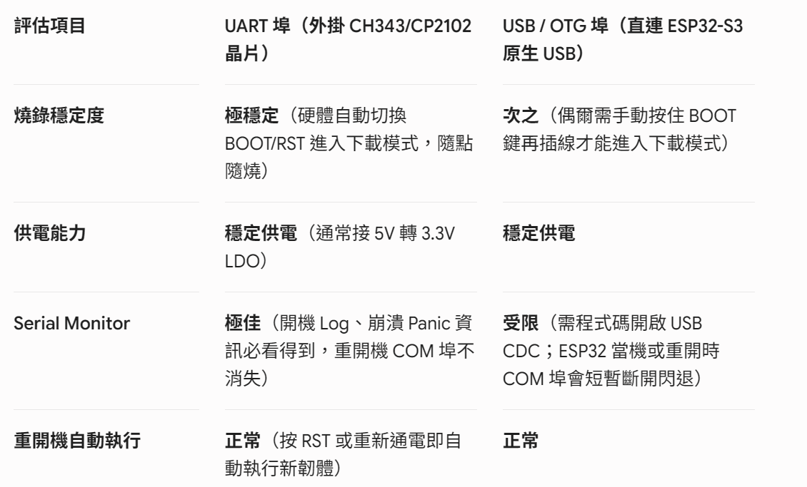

# Tiger Camera V1 firmware — Gate H1＋Gate L0

這是 AroundTW／GOOUUU ESP32-S3-CAM（ESP32-S3-WROOM-1-N16R8＋OV2640）的正式 PlatformIO 韌體。Gate H1 已通過實機驗收；Gate L0 的 Wi-Fi station、NTP、私人草稿背景上傳與領取碼顯示已實作並通過 production build，尚待燒錄後做熱點中斷／恢復實測。

## 已實作

- OV2640 與 ST7735 同時初始化。
- VGA 640 × 480 JPEG 即時預覽與拍照，兩者不切換 sensor mode，避免快門後
  自動白平衡重新收斂而使照片偏綠。
- GPIO1 快門，使用 `INPUT_PULLUP`、下降緣中斷鎖存與 35 ms debounce，
  不會因 JPEG 解碼／螢幕刷新漏掉短按。
- OV2640 保留自動白平衡、曝光與增益；針對偏白實測取消正亮度／曝光
  補償、提高對比與飽和並把 gain ceiling 降為 8×。數值集中在
  `include/app_config.h`。
- 拍照時切換至 VGA 640 × 480 JPEG，JPEG quality 為 8。
- 文字維持實機已確認正確的直式方向；照片不在順／逆時針 90°之間切換，
  而是保留 JPEG 原方向，將 160 × 120 中央裁為 96 × 120，再等比例放大為
  128 × 160 直式滿版。
- 狀態文字依實機可視區置中後再右移、上移各 3 px。
- 開機顯示 1 秒原生紅、綠、藍、白色條，協助區分 TFT 與相機偏色。
- 實機 BLACKTAB 色條曾顯示成藍、綠、紅、白，已確認為面板 BGR 色序並
  改用 `INITR_REDTAB`；JPEG byte swap 維持不變。
- 面板 inversion 實測為負片效果，已固定關閉；保留 REDTAB／BGR 色序。
- 先將 camera framebuffer 複製到自有 PSRAM，再歸還 framebuffer。
- 新配置成功後才原子替換上一張照片；失敗保留舊照片。
- mutex 保護最新 JPEG，供顯示與下一階段上傳共用。
- 拍後回看 3.5 秒，不顯示隨機文字。
- Serial 輸出 Flash、PSRAM、JPEG 大小與剩餘 PSRAM。
- Gate H1 診斷同時輸出至 OTG 的原生 USB CDC 與 TTL 的 UART0；兩者皆為
  115200 baud。
- Wi-Fi station 連接 `secrets.h` 中的 2.4 GHz 熱點／可信任 Wi-Fi；12 秒
  timeout 後以 2～60 秒指數退避重連，不建立 AP。
- 連網後以 NTP 同步 UTC；Backend 需要合法 `capturedAt`，因此時間完成同步
  前只等待，不送出錯誤日期。
- 每次成功拍攝產生穩定 UUID `clientRequestId`，執行
  `initiate → R2 PUT → complete`；失敗重試同一 UUID，不建立重複草稿。
- 上傳工作在 Core 0 的 FreeRTOS task 執行，另持有一份 PSRAM JPEG snapshot；
  HTTPS timeout、R2 PUT 或熱點斷線不會卡住 Core 1 的預覽與快門。
- 新拍攝會取代尚未開始上傳的舊工作；若舊工作已在 HTTP request 中，允許
  該 request 結束，但只顯示與目前最新照片 generation 相符的領取碼。
- `complete` 成功前不顯示領取碼。成功後顯示 6 位大字與 `VALID 24H`；在
  領取碼畫面短按一次只返回即時預覽，回到預覽後再次短按才拍攝下一張。
- API 與 R2 都使用 CA 驗證的 HTTPS；不使用 `setInsecure()`，device
  credential、R2／Neon／Admin secrets 皆不輸出至 Serial。

## 已確認硬體容量

2026-08-16 實機輸出：

- Flash：16,777,216 bytes（16 MB）。
- PSRAM：成功啟用。
- PSRAM：8,388,608 bytes（8 MB）。
- 啟動時可用 PSRAM：8,384,788 bytes。
- 相機 PID：`0x26`（OV2640），tuning applied。
- GPIO1：idle HIGH，按下後 press latched。
- 單次成功拍攝：20,174-byte JPEG；拍攝後可用 PSRAM 8,242,243 bytes。
- 實機最終確認：照片／文字方向正確，REDTAB／BGR 色序正確，inversion
  關閉，VGA 預覽與拍照回看顏色一致。

## 接線

| 功能 | GPIO／接法 |
|---|---|
| TFT SCL | GPIO47 |
| TFT SDA | GPIO21 |
| TFT DC | GPIO14 |
| TFT CS | GND |
| TFT RES | 主板 RST(EN) |
| TFT VCC | 依模組標示接 3.3 V／5 V；以已實測接法優先 |
| TFT GND | GND |
| TFT BLK | 依模組標示接 3.3 V／5 V；以已實測接法優先 |
| 快門 | GPIO1 與 GND 之間；程式使用內部上拉 |

GPIO1 已通過 10 次冷開機與 30 次連拍，可鎖定為原型快門腳位。

## 建置

實機上傳前，Backend 必須已部署成 ESP32 可連線的公開 HTTPS origin；
`localhost`、`127.0.0.1` 與電腦上的 Next.js dev URL 不能直接填給相機。正式
設定預期為 `https://api.tiger-camera.fengyenchia.com/api`，且該部署必須能
產生 ESP32 可直接存取的 R2 presigned PUT URL。

1. 安裝 VS Code PlatformIO extension 或 PlatformIO Core。
2. 複製 `include/secrets.example.h` 為 `include/secrets.h`。
3. 填入 2.4 GHz SSID、密碼、Backend API base URL、從 `/admin` 建立且只顯示
   一次的 device credential，以及 **API 網域**所需的 PEM root CA。不要把
   `dash.cloudflare.com` 或任何網站 leaf certificate 填進去，也不要關閉 TLS
   驗證。R2 的 GTS Root R4 公開信任根獨立放在 `include/r2_root_ca.h`。
4. 以 PlatformIO 開啟此資料夾並執行 Build。
5. 連接已確認可燒錄的 USB-C，執行 Upload。
6. 以 115200 baud 開啟 Serial Monitor。

`deviceCredential` 只代表這台相機，可在 `/admin` 撤銷；它不是 ESP32
credential、Admin JWT、R2 key 或 Neon connection string。`secrets.h` 已由
repository 根目錄 `.gitignore` 排除，仍要在 commit 前執行
`git status --ignored` 確認它沒有被加入。

### 在 VS Code 開啟 Serial Monitor

1. 將 USB-C 接到電腦；TTL 與 OTG 都支援本版的關鍵 log，但 Windows
   必須先出現對應 COM 裝置。
2. VS Code 左側開啟 PlatformIO，展開
   `tiger-camera-v1 → General → Monitor`；也可點底部狀態列的插頭圖示。
3. 若需要手動指定，在終端機先執行 `pio device list` 找到 `COMx`，再執行
   `pio device monitor --port COMx --baud 115200`。
4. Monitor 開啟後按一下主板 `RST`；只在開機前開過 Monitor、卻沒重置，
   會錯過前面的容量與相機初始化訊息。

若 PlatformIO 顯示 `No serial ports found`，先更換可傳資料的 USB 線、
確認驅動與 Windows 裝置管理員的「連接埠（COM 和 LPT）」。目前已由實機
成功取得 Camera、GPIO1 與 JPEG／PSRAM log。

```powershell
cd firmware/tiger-camera-v1
pio run
pio run --target upload
pio device monitor
```



Repository 已以 PlatformIO Core 6.1.19、Espressif32 platform 7.0.1、Arduino-ESP32 2.0.17 完成 production build。專案內含 N16R8 自訂 board 定義，讓 build／upload 明確使用 16 MB Flash 與 8 MB OPI PSRAM。初版已燒錄並顯示即時預覽；快門中斷與 OV2640 調校版已再次 build 成功，仍需重新 upload 實測。

## 實機驗收

1. Serial 顯示 16 MB Flash 與 8 MB PSRAM。
2. Camera 與 TFT 都成功初始化。
3. 即時預覽方向、色序與畫面位置正確。
4. 短按快門後顯示剛拍的照片約 3.5 秒。
5. 連拍 30 次，PSRAM 不持續下降，無壞圖、花屏或 reset。
6. 冷開機 10 次，GPIO1 快門不影響啟動。
7. 模擬一次配置失敗時，上一張有效照片仍可保留。

### Gate L0 實機驗收

1. 先開啟已設定的 2.4 GHz 熱點再開機，Serial 應依序出現
   `[wifi] connected`、`[time] NTP synchronization started`。
2. 拍一張照片；回看結束後應短暫顯示 `UPLOADING`，Serial 依序記錄
   `queued` 與 `complete`，最後螢幕只在 complete 成功後顯示 6 位碼。
3. 用手機進入 `https://tiger-camera.fengyenchia.com/create`，確認該碼可領取
   這一張照片，且照片方向與原始 JPEG 正確。
4. 關閉熱點後拍照：仍須能預覽、拍照、回看並顯示 `WAITING WIFI`，不得
   reset，也不得顯示新領取碼。
5. 重新開啟熱點：同一 generation 應自動完成上傳，Neon 只能新增一筆
   `(device_id, client_request_id)` 草稿。
6. 在斷網等待時連拍兩張：恢復後只要求最新一張的碼出現在 TFT；任何已經
   開始的舊 HTTP request 不得讓舊碼覆蓋新碼。
7. 在 `/admin` 撤銷裝置後再拍照，TFT 應顯示 `DEVICE ERROR / credential`，
   Server 不得建立草稿；恢復必須建立新 credential、更新 `secrets.h` 並重刷。
8. 完成 30 次上傳及至少 5 次熱點中斷／恢復，確認沒有重複草稿、截斷 JPEG、
   PSRAM 持續下降、brownout 或 reset，才能將 Gate L0 標為通過。

若 API initiate 成功，但 Serial 只在 `R2 PUT` 出現 `-9984 X509`，代表 API
CA 正確、R2 CA 錯誤，不是 JPEG 或 device credential 問題。2026-08-23 實測
R2 hostname 使用 `WE1 → GTS Root R4`；韌體已分開使用
`r2_root_ca.h`，並只記錄 hostname、不輸出 presigned query。若未來 chain
改變，更新該公開 CA 檔並重新 build，不可改用 `setInsecure()`。

## 本輪重新燒錄後先檢查

1. 115200 baud Serial 開機時應顯示
   `[shutter] GPIO1 idle=HIGH`。若是 `LOW`，請先放開按鍵並檢查是否把
   GPIO1 長期短接到 GND。
2. 每按一次外接快門，Serial 應立刻顯示
   `[shutter] press latched on GPIO1`，螢幕依序短暫顯示 `CAPTURING`，再
   回看照片約 3.5 秒。主板的 BOOT 鍵是 GPIO0，不是這版的快門。
3. 在相同室內光源觀察新版預覽。設定位置是
   `include/app_config.h` 的 `sensorBrightness`、`sensorSaturation`、
   `sensorAutoExposureLevel` 與 `sensorGainCeiling`；先不要一次調超過一級。
4. 若相機網頁／原始 JPEG 顏色正常，只有 TFT 偏灰或錯色，不要再提高
   相機飽和度，改測下方的 RGB byte swap 與 ST7735 tab 類型。
5. 若仍出現 `CAPTURE ERROR`，第二行會直接顯示 `no framebuffer`、
   `not JPEG` 或 `empty JPEG`；請連同該文字與任一 USB-C 的 Serial 輸出回報。
6. 開機最初 1 秒應由左至右看到鮮明紅、綠、藍、白色條：若色條正常而
   相機畫面灰／綠，問題在 sensor／白平衡；若色條也灰或順序不對，先修
   ST7735 tab／RGB byte order。

相機在 `esp_camera_init()` 時依 VGA 配置 PSRAM framebuffer，預覽與拍照也
都維持 VGA。按快門時不再切換解析度，因此能沿用即時預覽已穩定的曝光與
白平衡，並避免回看照片單獨偏綠。

128 × 160 螢幕只能用來取景，不能單獨判定 VGA 原圖是否真的失焦。若後續
取得原始 JPEG 仍模糊，再檢查 OV2640 鏡頭保護膜、拍攝距離與實際焦點；
不要在尚未看到原圖前強行旋轉或拆動鏡頭。

實機原生色條已證明面板需要 BGR，因此初始化由 `INITR_BLACKTAB` 改為
`INITR_REDTAB`；這不是 JPEG byte-order 問題，`TJpgDec.setSwapBytes(false)`
暫時維持不變。若新版原生色條順序已正確但仍整體偏灰，再單獨測試面板
反相／gamma，不再同時改相機 sensor 設定。

Gate H1 已通過。Gate L0 程式與 production build 已完成，但上述熱點、真實
API／R2 與實機壓力測試尚未執行，因此 Gate L0 目前仍是「實作完成、驗收中」。
