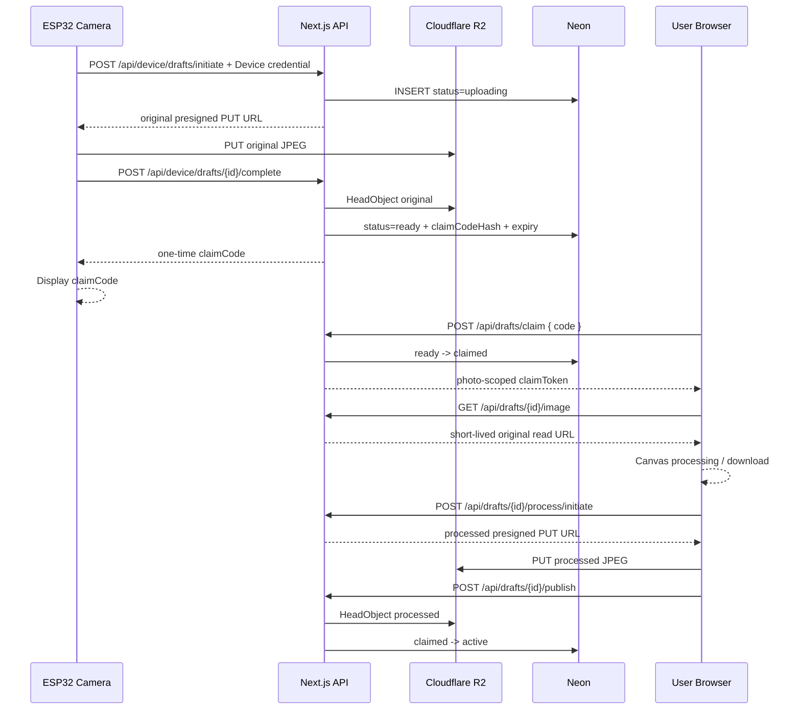

# Tiger Camera 後端入門：私人草稿、領取碼、R2、Neon 與 Next.js

這份文件是 `web/backend/` 正式後端的逐步實作教學。V1 使用兩個可獨立部署的 Next.js 專案：

- `web/frontend/`：頁面、Canvas 與 Axios 呼叫層。
- `web/backend/`：Route Handlers、CORS、驗證、R2 與 Neon。

- ESP32 連接 2.4 GHz 手機熱點或可信任 Wi-Fi。
- ESP32 拍照後只上傳私人原圖草稿。
- Server 確認原圖後產生短效領取碼，相機螢幕顯示該碼。
- 被動 NFC 固定開啟 `https://tiger-camera.fengyenchia.com/create`。
- 使用者輸入領取碼，在自己的手機後製、下載或選擇公開。
- 公開相簿所有人可看；只有管理員可永久刪除任意照片。

> 目前 repository 的 claim／publish Route Handler 是記憶體 Demo，測試碼為 `TIGER1`。以下是取代 Demo 的正式 R2／Neon 實作規格。

## 1. 三種身份不要混在一起

| 身份 | 憑證 | 保存位置 | 權限 |
|---|---|---|---|
| ESP32 裝置 | 高熵 opaque device credential | ESP32 NVS／韌體 secrets | 只能建立與完成私人原圖草稿 |
| 照片領取者 | 領取碼換來的短效 claim token | 使用者手機記憶體或 sessionStorage | 只能讀取、後製與發布同一張草稿 |
| 管理員 | 短效 Admin JWT | 使用者指定的 localStorage＋Axios Bearer | 管理裝置、清理草稿、永久刪除 |

禁止事項：

- ESP32 不保存 Admin JWT、R2 Access Key、Neon connection string 或 JWT signing secret。
- 領取碼不是永久 token；成功領取後立即失效。
- Claim token 和 Admin JWT 必須使用不同 `audience`／`scope`。
- 公開訪客不能列出 `uploading`、`ready` 或 `claimed` 草稿。

## 2. 完整資料流



## 3. 建立 Cloudflare R2

1. Cloudflare Dashboard → **Storage & databases → R2**。
2. 建立 private bucket，例如 `tiger-camera-photos`。
3. 不啟用 public `r2.dev` URL。
4. 建立只限此 bucket 的 Object Read & Write API token。
5. 保存 Account ID、Access Key ID、Secret Access Key；只放 Server environment variables。

Object keys 由 Server 決定：

```text
photos/{photoId}/original.jpg
photos/{photoId}/processed.jpg
```

R2 CORS 只需要 hosted browser 上傳 processed JPEG；ESP32 的 original PUT 不受瀏覽器 CORS 限制：

```json
[
  {
    "AllowedOrigins": [
      "http://localhost:3000",
      "https://tiger-camera.fengyenchia.com"
    ],
    "AllowedMethods": ["GET", "PUT", "HEAD"],
    "AllowedHeaders": ["Content-Type"],
    "ExposeHeaders": ["ETag"],
    "MaxAgeSeconds": 3600
  }
]
```

## 4. 建立 Neon PostgreSQL

### 4.1 建立 project

1. Neon Console 建立 `tiger-camera` project。
2. 選擇接近 Vercel Functions 的 region。
3. 從 **Connect** 複製 pooled connection string，保存為 `DATABASE_URL`。

### 4.2 建立正式 schema

將以下 SQL 保存為 `web/backend/lib/server/migrations/001_devices_and_photos.sql`，再於 Neon SQL Editor 執行：

```sql
CREATE EXTENSION IF NOT EXISTS pgcrypto;

CREATE TABLE devices (
  id uuid PRIMARY KEY DEFAULT gen_random_uuid(),
  name text NOT NULL,
  credential_hash text NOT NULL UNIQUE,
  status text NOT NULL DEFAULT 'active'
    CHECK (status IN ('active', 'revoked')),
  created_at timestamptz NOT NULL DEFAULT now(),
  last_seen_at timestamptz
);

CREATE TABLE photos (
  id uuid PRIMARY KEY DEFAULT gen_random_uuid(),
  device_id uuid NOT NULL REFERENCES devices(id),
  client_request_id uuid NOT NULL,
  original_key text NOT NULL UNIQUE,
  processed_key text UNIQUE,
  status text NOT NULL
    CHECK (status IN ('uploading', 'ready', 'claimed', 'active', 'deleting')),
  claim_code_hash text UNIQUE,
  claim_expires_at timestamptz,
  claimed_at timestamptz,
  published_at timestamptz,
  title text,
  captured_at timestamptz NOT NULL,
  created_at timestamptz NOT NULL DEFAULT now(),
  completed_at timestamptz,
  frame_enabled boolean,
  timestamp_enabled boolean,
  text_mode text CHECK (text_mode IS NULL OR text_mode IN ('custom', 'default', 'none')),
  custom_text text,
  resolved_text text,
  filter_preset text CHECK (
    filter_preset IS NULL OR
    filter_preset IN ('tiger-film', 'jungle-green', 'baby-tiger', 'night-hunter')
  ),
  processing_version text,
  mime_type text NOT NULL DEFAULT 'image/jpeg' CHECK (mime_type = 'image/jpeg'),
  width integer,
  height integer,
  original_size integer,
  processed_size integer,
  UNIQUE (device_id, client_request_id),
  CONSTRAINT photos_claim_fields_check CHECK (
    (status = 'uploading' AND claim_code_hash IS NULL) OR
    (status IN ('ready', 'claimed') AND claim_code_hash IS NOT NULL) OR
    (status IN ('active', 'deleting'))
  )
);

CREATE INDEX photos_public_idx
  ON photos (published_at DESC)
  WHERE status = 'active';

CREATE INDEX photos_cleanup_idx
  ON photos (status, claim_expires_at);
```

正式 migration 還要決定 active 後是否清空 `claim_code_hash`。建議發布後清空或保留不可逆 audit hash；不要保存明碼。

## 5. 安裝套件

在 `web/` 執行，並把套件安裝到 Backend workspace：

```powershell
pnpm --dir backend add @aws-sdk/client-s3 @aws-sdk/s3-request-presigner @neondatabase/serverless jose bcryptjs server-only
```

## 6. Environment variables

`web/backend/.env.local`：

```dotenv
DATABASE_URL=postgresql://...
R2_ACCOUNT_ID=...
R2_ACCESS_KEY_ID=...
R2_SECRET_ACCESS_KEY=...
R2_BUCKET_NAME=tiger-camera-photos
ADMIN_JWT_SECRET=至少_32_bytes_亂數
CLAIM_JWT_SECRET=另一組至少_32_bytes_亂數
CLAIM_CODE_HMAC_SECRET=第三組至少_32_bytes_亂數
ADMIN_USERNAME=你的管理員帳號
ADMIN_PASSWORD_HASH=bcrypt_hash
FRONTEND_ORIGIN=http://localhost:3000,https://tiger-camera.fengyenchia.com
```

這些都不能加 `NEXT_PUBLIC_`。Vercel Production／Preview／Development 要分開設定；更新後重新部署。

## 7. Server-only 模組

```text
web/backend/lib/server/
├── env.ts
├── db.ts
├── r2.ts
├── device-auth.ts
├── admin-auth.ts
├── claim-auth.ts
├── claim-code.ts
├── drafts.ts
├── photos.ts
└── validation.ts
```

所有檔案先 `import "server-only"`。`web/frontend/api/` 是瀏覽器 Axios layer；`web/backend/app/api/` 才會產生 HTTP endpoint。Frontend 不得 import Backend 的 server-only 檔案。

Backend 另以 `web/backend/proxy.ts` 處理 `/api/*` CORS：只允許 `FRONTEND_ORIGIN` 白名單，preflight 接受 `Authorization` 與 `Content-Type`。ESP32 不是瀏覽器，不受 CORS 當作身分驗證；它仍必須提供 device credential。

### 7.1 R2 client

```ts
import "server-only";
import { PutObjectCommand, S3Client } from "@aws-sdk/client-s3";
import { getSignedUrl } from "@aws-sdk/s3-request-presigner";

export const r2 = new S3Client({
  region: "auto",
  endpoint: `https://${process.env.R2_ACCOUNT_ID}.r2.cloudflarestorage.com`,
  credentials: {
    accessKeyId: process.env.R2_ACCESS_KEY_ID!,
    secretAccessKey: process.env.R2_SECRET_ACCESS_KEY!,
  },
});

export function createJpegPutUrl(key: string) {
  return getSignedUrl(
    r2,
    new PutObjectCommand({
      Bucket: process.env.R2_BUCKET_NAME!,
      Key: key,
      ContentType: "image/jpeg",
    }),
    { expiresIn: 300 },
  );
}
```

### 7.2 領取碼

領取碼使用安全亂數，不用 photo UUID 截短：

```ts
import "server-only";
import { createHmac, randomInt } from "node:crypto";

const alphabet = "23456789ABCDEFGHJKLMNPQRSTUVWXYZ";

export function createClaimCode(length = 7) {
  return Array.from({ length }, () => alphabet[randomInt(alphabet.length)]).join("");
}

export function hashClaimCode(code: string) {
  return createHmac("sha256", process.env.CLAIM_CODE_HMAC_SECRET!)
    .update(code.trim().toUpperCase())
    .digest("hex");
}
```

若 `claim_code_hash` UNIQUE 衝突，重新產生。不要使用普通 SHA-256 裸 hash，否則短碼容易被離線枚舉。

### 7.3 Claim token

```ts
import "server-only";
import { jwtVerify, SignJWT } from "jose";

const claimSecret = new TextEncoder().encode(process.env.CLAIM_JWT_SECRET!);

export function createClaimToken(draftId: string) {
  return new SignJWT({ scope: ["draft:read", "draft:process", "draft:publish"] })
    .setProtectedHeader({ alg: "HS256" })
    .setSubject(draftId)
    .setIssuer("tiger-camera")
    .setAudience("tiger-camera-claim")
    .setIssuedAt()
    .setExpirationTime("45m")
    .sign(claimSecret);
}

export async function requireClaimToken(token: string, draftId: string) {
  const { payload } = await jwtVerify(token, claimSecret, {
    issuer: "tiger-camera",
    audience: "tiger-camera-claim",
  });
  if (payload.sub !== draftId) throw new Error("FORBIDDEN");
  return payload;
}
```

Admin JWT 使用不同 secret、audience `tiger-camera-admin` 與 `role=admin`，仍依既定決策存 localStorage 並由 Axios interceptor 主動附加。

## 8. Device API

### 8.1 `POST /api/device/drafts/initiate`

Header：

```http
Authorization: Bearer <device-credential>
Content-Type: application/json
```

Body：

```json
{
  "clientRequestId": "device-generated-uuid",
  "capturedAt": "2026-08-13T10:30:00.000Z",
  "mimeType": "image/jpeg",
  "width": 1600,
  "height": 1200,
  "originalSize": 582341
}
```

Server：

1. hash credential 並查找 `devices.status = active`。
2. 驗證 UUID、時間、JPEG、大小、尺寸與最大像素。
3. 以 `(device_id, client_request_id)` 保證 idempotency。
4. 建立 `uploading` 與 Server-controlled original key。
5. 回傳五分鐘 presigned PUT URL。

Response `201`：

```json
{
  "draftId": "uuid",
  "upload": {
    "url": "https://...r2.cloudflarestorage.com/...",
    "method": "PUT",
    "headers": { "Content-Type": "image/jpeg" }
  },
  "expiresAt": "2026-08-13T10:35:00.000Z"
}
```

### 8.2 `POST /api/device/drafts/:id/complete`

1. 再次驗證 device credential，確認 draft 屬於此 device。
2. 對 original key 執行 `HeadObject`。
3. 驗證 MIME 與實際大小。
4. 產生 7 位 code，保存 HMAC hash 與 `claim_expires_at`。
5. transaction 將 `uploading → ready`。
6. response 只回傳一次明碼，ESP32 顯示於螢幕。

```json
{
  "draftId": "uuid",
  "status": "ready",
  "claimCode": "T8K4P2X",
  "claimExpiresAt": "2026-08-13T11:00:00.000Z"
}
```

未通過 `HeadObject` 不得回領取碼。ESP32 重送 complete 時，若明碼已遺失，Server 不應從 hash 還原；可設計一次短暫 encrypted delivery 欄位，或讓裝置重新 initiate 新草稿。V1 最簡單做法是 ESP32 收到 response 後立即在 RAM 保存 code 至照片被取代。

## 9. Claim 與私人讀取 API

### 9.1 `POST /api/drafts/claim`

```json
{ "code": "T8K4P2X" }
```

執行順序：

1. 正規化大寫並限制 6～8 位允許字元。
2. 在進資料庫前做 IP rate limit。
3. 計算 HMAC hash 查詢 `ready` 且未過期草稿。
4. 使用 transaction／條件 UPDATE 將 `ready → claimed`，避免兩支手機同時領取。
5. 清除或失效 code，簽發 45 分鐘 photo-scoped claim token。
6. 對錯碼、過期、已使用統一回 `404 CLAIM_UNAVAILABLE`，不要透露差異。

Response：

```json
{
  "draft": {
    "id": "uuid",
    "claimToken": "short-lived-jwt",
    "capturedAt": "2026-08-13T10:30:00.000Z",
    "expiresAt": "2026-08-13T11:15:00.000Z",
    "originalUrl": "/api/drafts/uuid/image"
  }
}
```

### 9.2 `GET /api/drafts/:id/image`

- 要求 `Authorization: Bearer <claim-token>`。
- token subject 必須等於 URL draft ID。
- 只允許 `claimed` 草稿。
- Server 從 Neon 取得 original key，再回 1～5 分鐘 R2 presigned GET redirect。
- 不接受瀏覽器傳任意 object key。

## 10. 後製與 Publish API

### 10.1 Canvas 選項

```ts
type ProcessingOptions = {
  frameEnabled: boolean;
  timestampEnabled: boolean;
  textMode: "custom" | "default" | "none";
  customText: string | null;
  resolvedText: string | null;
  filterPreset: "tiger-film" | "jungle-green" | "baby-tiger" | "night-hunter" | null;
  processingVersion: "canvas-v1";
};
```

四項可任意複選或全部關閉。預設文字固定為：`ROAR!`、`抓到你了！`、`虎視眈眈！`、`今日獵物 +1`、`小虎拍到了！`。抽到的實際內容保存為 `resolvedText`。

### 10.2 `POST /api/drafts/:id/process/initiate`

- 驗證 claim token 與 draft ID。
- 草稿必須為 `claimed`。
- 驗證 processed JPEG 預計大小與 processing metadata。
- Server 建立唯一 processed key 並回五分鐘 presigned PUT URL。

### 10.3 瀏覽器 PUT processed

使用原始 Axios，不要使用附有 Admin JWT 的 `apiClient`：

```ts
await axios.put(upload.url, processedBlob, {
  headers: { "Content-Type": "image/jpeg" },
});
```

### 10.4 `POST /api/drafts/:id/publish`

Body 帶 processing metadata、title、width／height／processedSize。Server：

1. 驗證 claim token、draft ID 與 `claimed` 狀態。
2. `HeadObject` 驗證 processed object。
3. 驗證文字欄位組合與 filter preset。
4. transaction 寫入 metadata、`published_at`，將 `claimed → active`。
5. 只有 response 成功後，UI 才顯示「已公開」。

Claim token 重送 publish 時，若已是同一筆 `active` 應回既有結果，避免建立重複照片。

## 11. 公開相簿與管理員刪除

| Method | Path | 權限 |
|---|---|---|
| `GET` | `/api/photos` | 公開，只列 `active` |
| `GET` | `/api/photos/:id/image?variant=original|processed` | 公開，只讀 `active` |
| `DELETE` | `/api/photos/:id` | Admin JWT |

永久刪除仍是一次操作、沒有二次確認：

1. `active → deleting`，公開列表立即消失。
2. Server 刪 original 與 processed R2 objects。
3. 以 `HeadObject`／404 確認兩者不存在。
4. 刪除 Neon metadata。
5. 部分失敗保留 `deleting`，供管理員安全重試。

## 12. 草稿清理

至少需要一個受保護的 Vercel Cron endpoint：

- 清理超過 15 分鐘仍 `uploading` 的 metadata 與孤兒 original object。
- 清理超過 24 小時仍未領取的 `ready` 草稿。
- 清理 claim token 早已過期且長時間未發布的 `claimed` 草稿。
- 每次最多處理固定筆數，使用 idempotent delete，記錄 photo ID 與結果但不記 secrets／code。

時間值先做 environment/config，經實機使用後再鎖定。

## 13. 從 Demo 到正式版的實作順序

### Gate A：資料與 Server 基礎

1. 建立 migration、R2 private bucket、CORS、Neon 與 environment variables。
2. 建立 `db.ts`、`r2.ts`、validation 與一致錯誤格式。
3. 以測試 script 驗證 presigned PUT、HeadObject、GET、DELETE。

### Gate B：裝置生命週期

1. 建立一筆 device，產生 credential，只在註冊時顯示一次，DB 保存 hash。
2. 實作 device initiate／complete。
3. 用 Postman 或固定 JPEG 模擬 ESP32 完成 `uploading → ready`。
4. 驗證同一 `clientRequestId` 不重複。

### Gate C：領取碼

1. 實作安全亂數、HMAC hash、期限與 rate limit。
2. 實作原子 `ready → claimed` 與 claim JWT。
3. 實作私人原圖 endpoint。
4. 驗證錯碼、過期碼、已用碼與同時領取。

### Gate D：Canvas 與發布

1. 將現有 `/create` Demo API 換成正式 claim API。
2. Canvas 測試橫式、直式、低光、中文、全關閉與各種組合。
3. 實作 process initiate／PUT／publish。
4. 確認只下載時完全不呼叫 publish。

### Gate E：管理、清理與部署

1. 實作 Admin JWT、Axios Bearer interceptor、裝置撤銷與永久刪除。
2. 建立 cron 清理。
3. 執行安全測試、typecheck、lint、production build 與 E2E。
4. 建立 Frontend／Backend 兩個 Vercel projects；Frontend 綁定 `tiger-camera.fengyenchia.com`，Backend 設定 secrets 與 `FRONTEND_ORIGIN`，Frontend 設定 `NEXT_PUBLIC_API_BASE_URL`。

## 14. 最小驗證清單

1. 已撤銷 device credential 無法 initiate。
2. 未完成 original PUT 時，complete 不回領取碼。
3. 同一拍攝重試不建立重複草稿。
4. 錯誤領取碼被 rate limit，response 不洩漏狀態。
5. 正確 code 只能成功交換一次。
6. Claim token 只能讀取及發布自己的 draft ID。
7. Claim token 不能呼叫 Admin DELETE。
8. 不公開時可下載，`GET /api/photos` 不出現草稿。
9. 公開時 processed object 與 metadata 完整後才變 `active`。
10. 未登入訪客能看公開相簿，但看不到私人草稿。
11. 管理員一次刪除後，兩個 R2 objects 與 metadata 都消失。
12. 手機熱點斷線後 ESP32 保留最新照片並可重試。
13. 過期 `uploading／ready／claimed` 草稿會被清理。
14. Vercel 重新部署後資料仍存在。

## 15. 常見錯誤

### ESP32 收到 `401 DEVICE_UNAUTHORIZED`

- 確認 device ID／credential 沒有空白或被撤銷。
- 不要印出完整 credential；只記 device ID 與錯誤碼。

### R2 `SignatureDoesNotMatch`

- URL 是否過期。
- PUT method 與 `Content-Type: image/jpeg` 是否完全一致。
- 不要修改 query string 或 object key。

### 領取碼總是無法使用

- 比對前是否統一大寫並移除分隔空白。
- Server 時區使用 UTC；檢查 `claim_expires_at`。
- 確認 code 已被領取後沒有再次使用。

### 手機熱點不穩

- 確認熱點支援／強制 2.4 GHz 相容模式。
- 關閉會快速停用熱點的省電設定。
- 韌體使用重連與指數退避，不能因 Wi-Fi 失敗重啟拍照核心。

## 16. 官方參考

- [Cloudflare R2 Presigned URLs](https://developers.cloudflare.com/r2/api/s3/presigned-urls/)
- [Cloudflare R2 CORS](https://developers.cloudflare.com/r2/buckets/cors/)
- [Neon Serverless Driver](https://neon.com/docs/serverless/serverless-driver)
- [Next.js Route Handlers](https://nextjs.org/docs/app/getting-started/route-handlers)
- [Next.js Authentication Guide](https://nextjs.org/docs/app/guides/authentication)
