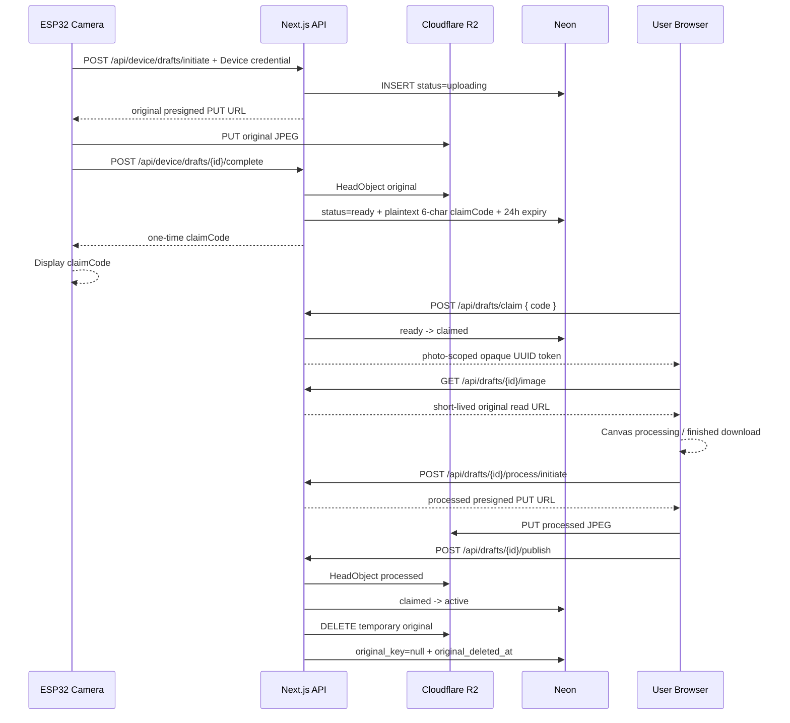

# Tiger Camera 後端入門：私人草稿、領取碼、R2、Neon 與 Next.js

這份文件是 `web/backend/` 正式後端的逐步實作教學。V1 使用兩個可獨立部署的 Next.js 專案：

- `web/frontend/`：頁面、Canvas 與 Axios 呼叫層。
- `web/backend/`：Route Handlers、CORS、驗證、R2 與 Neon。

- ESP32 連接 2.4 GHz 手機熱點或可信任 Wi-Fi。
- ESP32 拍照後只上傳私人原圖草稿。
- Server 確認原圖後產生短效領取碼，相機螢幕顯示該碼。
- 被動 NFC 固定開啟 `https://tiger-camera.fengyenchia.com/create`。
- 使用者輸入領取碼，在自己的手機後製、下載完成圖或選擇公開；原圖不提供下載。
- 公開相簿所有人可看；只有管理員可永久刪除任意照片。

> 正式 R2／Neon、Device、Claim、Admin 與 Cleanup 程式已寫入 repository；但尚未使用你的真實 Cloudflare、Neon 與 Vercel Production 做 E2E。完成本文件的外部設定與驗收前，不代表已上線。

### 目前程式碼快照（2026-08-15）

- Frontend 與 Backend 已拆成兩個 Next.js 專案，以 `web/pnpm-workspace.yaml` 管理。
- Frontend 已完成 `/`、`/create`、`/gallery` 與 Axios 呼叫層。
- Backend 已完成 Device initiate／complete、Claim、私人原圖、processed PUT／publish、公開照片、Admin 與 Cleanup Route Handlers。
- Backend 已完成 `/api/docs` Swagger UI 與 `/api/openapi`；只列出實際存在的 endpoints。
- `/create` 的拍攝時間由 API `capturedAt` 自動帶入；使用者只選擇是否顯示，不提供日期時間選擇器。
- Frontend 已完成正式 presigned PUT／publish 與 `/admin`。Neon migration、R2 bucket、Vercel variables、DNS 與真實雲端 E2E 仍需由你完成。

## 1. 三種身份不要混在一起

| 身份 | 憑證 | 保存位置 | 權限 |
|---|---|---|---|
| ESP32 裝置 | 高熵 opaque device credential | ESP32 NVS／韌體 secrets | 只能建立與完成私人原圖草稿 |
| 照片領取者 | 6 位配對碼換來的 opaque UUID token | 使用者手機記憶體或 sessionStorage | 只能讀取、後製與發布同一張草稿 |
| 管理員 | 短效 Admin JWT | 使用者指定的 localStorage＋Axios Bearer | 管理裝置、清理草稿、永久刪除 |

禁止事項：

- ESP32 不保存 Admin JWT、R2 Access Key、Neon connection string 或管理員 JWT signing secret。
- 領取碼只負責把人帶到某張照片，不視為安全密碼；猜到別人的碼是已接受的產品取捨。
- 領取成功後配對碼立即失效；後續用資料庫保存的 UUID Bearer token 操作該張草稿。這個 token 不是 JWT，也不能呼叫管理員 API。
- 公開訪客不能列出 `uploading`、`ready` 或 `claimed` 草稿。

## 2. 完整資料流



## 3. 建立 Cloudflare R2

1. Cloudflare Dashboard → **Storage & databases → R2**。
2. 建立 private bucket，例如 `tiger-camera-photos`。
3. 不啟用 public `r2.dev` URL。
4. 建立只限此 bucket 的 Object Read & Write API token。
5. 保存 Account ID、Access Key ID、Secret Access Key；只放 Server environment variables。

Object keys 由 Server 決定：

```text
drafts/{photoId}/original.jpg      # 暫存，發布或逾期後刪除
photos/{photoId}/finished.jpg      # 公開完成圖，永久保存至管理員刪除
```

R2 CORS 只需要 hosted browser 上傳 processed JPEG；ESP32 的 original PUT 不受瀏覽器 CORS 限制：

```json
[
  {
    "AllowedOrigins": [
      "http://localhost:3000",
      "https://tiger-camera.fengyenchia.com"
    ],
    "AllowedMethods": ["GET", "PUT", "HEAD"],
    "AllowedHeaders": ["Content-Type"],
    "ExposeHeaders": ["ETag"],
    "MaxAgeSeconds": 3600
  }
]
```

## 4. 建立 Neon PostgreSQL

### 4.1 建立 project

1. Neon Console 建立 `tiger-camera` project。
2. 選擇接近 Vercel Functions 的 region。
3. 從 **Connect** 複製 pooled connection string，保存為 `DATABASE_URL`。

### 4.2 建立正式 schema

正式 migration 已存在 `web/backend/lib/server/migrations/001_devices_and_photos.sql`。請以該檔案為唯一正式版本，將完整內容複製到 Neon SQL Editor 執行。下方為同版本參考：

```sql
CREATE EXTENSION IF NOT EXISTS pgcrypto;

CREATE TABLE devices (
  id uuid PRIMARY KEY DEFAULT gen_random_uuid(),
  name text NOT NULL,
  credential_hash text NOT NULL UNIQUE,
  status text NOT NULL DEFAULT 'active'
    CHECK (status IN ('active', 'revoked')),
  created_at timestamptz NOT NULL DEFAULT now(),
  last_seen_at timestamptz
);

CREATE TABLE photos (
  id uuid PRIMARY KEY DEFAULT gen_random_uuid(),
  device_id uuid NOT NULL REFERENCES devices(id),
  client_request_id uuid NOT NULL,
  original_key text UNIQUE,
  processed_key text UNIQUE,
  status text NOT NULL
    CHECK (status IN ('uploading', 'ready', 'claimed', 'active', 'deleting')),
  claim_code text UNIQUE
    CHECK (claim_code IS NULL OR claim_code ~ '^[A-F0-9]{6}$'),
  claim_expires_at timestamptz,
  claim_token uuid UNIQUE,
  claim_token_expires_at timestamptz,
  claimed_at timestamptz,
  published_at timestamptz,
  original_deleted_at timestamptz,
  title text,
  captured_at timestamptz NOT NULL,
  created_at timestamptz NOT NULL DEFAULT now(),
  completed_at timestamptz,
  frame_enabled boolean,
  timestamp_enabled boolean,
  text_mode text CHECK (text_mode IS NULL OR text_mode IN ('custom', 'default', 'none')),
  custom_text text,
  resolved_text text,
  filter_preset text CHECK (
    filter_preset IS NULL OR
    filter_preset IN ('none', 'tiger-film', 'jungle-green', 'baby-tiger', 'night-hunter')
  ),
  processing_version text,
  mime_type text NOT NULL DEFAULT 'image/jpeg' CHECK (mime_type = 'image/jpeg'),
  width integer CHECK (width IS NULL OR width > 0),
  height integer CHECK (height IS NULL OR height > 0),
  original_size integer CHECK (original_size IS NULL OR original_size > 0),
  processed_size integer CHECK (processed_size IS NULL OR processed_size > 0),
  UNIQUE (device_id, client_request_id),
  CONSTRAINT photos_object_keys_check CHECK (
    (status IN ('uploading', 'ready', 'claimed') AND original_key IS NOT NULL) OR
    (status IN ('active', 'deleting') AND processed_key IS NOT NULL)
  ),
  CONSTRAINT photos_claim_fields_check CHECK (
    (status = 'uploading' AND claim_code IS NULL AND claim_token IS NULL) OR
    (status = 'ready' AND claim_code IS NOT NULL AND claim_token IS NULL) OR
    (status = 'claimed' AND claim_code IS NULL AND claim_token IS NOT NULL) OR
    (status IN ('active', 'deleting') AND claim_code IS NULL AND claim_token IS NULL)
  )
);

CREATE INDEX photos_public_idx
  ON photos (published_at DESC)
  WHERE status = 'active';

CREATE INDEX photos_cleanup_idx
  ON photos (status, claim_expires_at, claim_token_expires_at, created_at);

CREATE INDEX photos_original_cleanup_idx
  ON photos (published_at)
  WHERE status = 'active' AND original_key IS NOT NULL;
```

配對碼本來就以明碼保存，因為它不是安全憑證。`ready → claimed` 時將 `claim_code` 設為 null，UUID token 到期或發布後也設為 null；不要把它們寫進 log。

## 5. 安裝套件

在 `web/` 執行，並把套件安裝到 Backend workspace：

```powershell
pnpm --dir backend add @aws-sdk/client-s3 @aws-sdk/s3-request-presigner @neondatabase/serverless jose bcryptjs server-only
```

## 6. Environment variables

`web/backend/.env.local`：

```dotenv
DATABASE_URL=postgresql://...
R2_ENDPOINT=https://你的_ACCOUNT_ID.r2.cloudflarestorage.com
R2_ACCESS_KEY_ID=...
R2_SECRET_ACCESS_KEY=...
R2_BUCKET_NAME=tiger-camera-photos
R2_REGION=auto
ADMIN_JWT_SECRET=至少_32_bytes_亂數
ADMIN_USERNAME=你的管理員帳號
ADMIN_PASSWORD_HASH=\$2b\$12\$your_bcrypt_hash
CRON_SECRET=另一組長亂數
FRONTEND_ORIGIN=http://localhost:3000,https://tiger-camera.fengyenchia.com
API_PUBLIC_URL=http://localhost:3001
```

這些都不能加 `NEXT_PUBLIC_`。Vercel Production／Preview／Development 要分開設定；更新後重新部署。

不需要 `CLAIM_JWT_SECRET` 或 `CLAIM_CODE_HMAC_SECRET`。執行 `cd web/backend` 後使用 `pnpm admin:hash-password` 產生 bcrypt 雜湊；腳本會同時顯示兩種可複製格式。在本機 `.env.local` 中，bcrypt 的每個 `$` 都要寫成 `\$`，因為 Next.js 會對 env 檔做變數展開；只加引號不能解決。在 Vercel Dashboard 的 Environment Variable Value 則填原始 `$2b$...` hash，不加反斜線。`ADMIN_JWT_SECRET` 與 `CRON_SECRET` 使用密碼管理器或系統安全亂數產生，不能直接填範例文字。

正式 Backend 的 `API_PUBLIC_URL` 設為 `https://api.tiger-camera.fengyenchia.com`，Frontend 的 `NEXT_PUBLIC_API_BASE_URL` 設為 `https://api.tiger-camera.fengyenchia.com/api`。

`API_PUBLIC_URL` 只能填一個 Backend 根網址：不可用逗號同時填 localhost 與正式網址，也不可在結尾加 `/api`。本機與 Vercel 分別使用各自的環境變數值。

## 6.1 OpenAPI 與 Swagger UI

目前使用：

- `next-swagger-doc`：掃描 `web/backend/app/api/**/route.ts` 的 `@swagger` JSDoc，產生 OpenAPI 3.0.3。
- `swagger-ui-dist`：顯示互動式 Swagger UI；不使用會產生 React 19 peer warning 的 `swagger-ui-react`。
- `GET /api/docs`：Swagger UI。
- `GET /api/openapi`：原始 OpenAPI JSON。

新增或修改已實作 Route Handler 時，必須同步更新同檔案的 `@swagger` 區塊。尚未實作的 API 只留在本規劃文件，不提前加入 Swagger，避免使用者誤以為可以呼叫。Swagger security schemes 可描述 Device、Claim、Admin Bearer 格式，但絕不能包含真實 token 或 secrets。

## 7. Server-only 模組

```text
web/backend/lib/server/
├── env.ts
├── db.ts
├── r2.ts
├── device-auth.ts
├── admin-auth.ts
├── claim-auth.ts
├── claim-code.ts
├── drafts.ts
├── photos.ts
└── validation.ts
```

所有檔案先 `import "server-only"`。`web/frontend/api/` 是瀏覽器 Axios layer；`web/backend/app/api/` 才會產生 HTTP endpoint。Frontend 不得 import Backend 的 server-only 檔案。

Backend 另以 `web/backend/proxy.ts` 處理 `/api/*` CORS：只允許 `FRONTEND_ORIGIN` 白名單，preflight 接受 `Authorization` 與 `Content-Type`。ESP32 不是瀏覽器，不受 CORS 當作身分驗證；它仍必須提供 device credential。

### 7.1 R2 client

```ts
import "server-only";
import { PutObjectCommand, S3Client } from "@aws-sdk/client-s3";
import { getSignedUrl } from "@aws-sdk/s3-request-presigner";

export const r2 = new S3Client({
  region: "auto",
  endpoint: process.env.R2_ENDPOINT,
  credentials: {
    accessKeyId: process.env.R2_ACCESS_KEY_ID!,
    secretAccessKey: process.env.R2_SECRET_ACCESS_KEY!,
  },
});

export function createJpegPutUrl(key: string) {
  return getSignedUrl(
    r2,
    new PutObjectCommand({
      Bucket: process.env.R2_BUCKET_NAME!,
      Key: key,
      ContentType: "image/jpeg",
    }),
    { expiresIn: 300 },
  );
}
```

### 7.2 領取碼與 UUID token

領取碼只是方便手動輸入的配對碼。使用 UUID 產生 6 位十六進位字串，並以資料庫 `UNIQUE` 處理碰撞；完整 UUID 則作為領取後的 opaque Bearer token：

```ts
import "server-only";
import { randomUUID } from "node:crypto";

export function createClaimCode() {
  return randomUUID().replaceAll("-", "").slice(0, 6).toUpperCase();
}

export function createClaimToken() {
  return randomUUID();
}
```

插入或更新時若 `claim_code` 違反 UNIQUE，就重新產生。6 位碼可被猜到是已接受的產品取捨；它的目的只是配對，不宣稱保密。

### 7.3 Claim token

每次 Draft API 收到 `Authorization: Bearer <uuid>` 時，直接查詢 `id = draftId`、`claim_token = token`、`status = claimed` 且 `claim_token_expires_at > now()`；查不到就回 401。UUID token 不需要簽名、解析或 `jose`。

Admin JWT 是另一套真正的管理員驗證，仍使用 secret、audience `tiger-camera-admin` 與 `role=admin`，依既定決策存 localStorage 並由 Axios interceptor 主動附加。

## 8. Device API

### 8.1 `POST /api/device/drafts/initiate`

Header：

```http
Authorization: Bearer <device-credential>
Content-Type: application/json
```

Body：

```json
{
  "clientRequestId": "device-generated-uuid",
  "capturedAt": "2026-08-13T10:30:00.000Z",
  "mimeType": "image/jpeg",
  "width": 1600,
  "height": 1200,
  "originalSize": 582341
}
```

Server：

1. hash credential 並查找 `devices.status = active`。
2. 驗證 UUID、時間、JPEG、大小、尺寸與最大像素。
3. 以 `(device_id, client_request_id)` 保證 idempotency。
4. 建立 `uploading` 與 Server-controlled original key。
5. 回傳五分鐘 presigned PUT URL。

Response `201`：

```json
{
  "draftId": "uuid",
  "upload": {
    "url": "https://...r2.cloudflarestorage.com/...",
    "method": "PUT",
    "headers": { "Content-Type": "image/jpeg" }
  },
  "expiresAt": "2026-08-13T10:35:00.000Z"
}
```

### 8.2 `POST /api/device/drafts/:id/complete`

1. 再次驗證 device credential，確認 draft 屬於此 device。
2. 對 original key 執行 `HeadObject`。
3. 驗證 MIME 與實際大小。
4. 產生 6 位 code，以明碼保存到 UNIQUE `claim_code`，並把 `claim_expires_at` 設為 24 小時後。
5. transaction 將 `uploading → ready`。
6. response 只回傳一次明碼，ESP32 顯示於螢幕。

```json
{
  "draftId": "uuid",
  "status": "ready",
  "claimCode": "A4F92C",
  "claimExpiresAt": "2026-08-14T10:30:00.000Z"
}
```

未通過 `HeadObject` 不得回領取碼。因資料庫直接保存明碼，ESP32 重送 complete 時可在草稿仍為 `ready` 的前提下取得同一個 code，不需要 encrypted delivery 或 hash 還原流程。

## 9. Claim 與私人讀取 API

### 9.1 `POST /api/drafts/claim`

```json
{ "code": "A4F92C" }
```

執行順序：

1. 正規化大寫並限制剛好 6 位英數字。
2. 直接以明碼 `claim_code` 查詢 `ready` 且未超過 24 小時的草稿。
3. 產生完整 UUID token。
4. 使用 transaction／條件 UPDATE 將 `ready → claimed`、`claim_code = null`、寫入 `claim_token` 與 24 小時 token 期限，避免兩支手機同時領取。
5. 找不到、已領取或已過期時回一般錯誤即可；V1 不做 HMAC、猜碼防護或 claim rate limit。

Response：

```json
{
  "draft": {
    "id": "uuid",
    "claimToken": "9d4e0b7a-31c4-4f55-8c26-7b0e6a14d2f3",
    "capturedAt": "2026-08-13T10:30:00.000Z",
    "expiresAt": "2026-08-14T10:30:00.000Z",
    "originalUrl": "/api/drafts/uuid/image"
  }
}
```

### 9.2 `GET /api/drafts/:id/image`

- 要求 `Authorization: Bearer <claim-token>`。
- UUID token 必須在資料庫中屬於 URL draft ID，且尚未到期。
- 只允許 `claimed` 草稿；不要嘗試解碼 UUID，它只是資料庫 lookup key。
- Server 從 Neon 取得 original key，再回 1～5 分鐘 R2 presigned GET redirect。
- 不接受瀏覽器傳任意 object key。
- UI 不提供原圖下載，但瀏覽器取得 bytes 後無法以技術手段禁止合法領取者另存；安全要求是其他人與公開 API 都無法取得該 original。

## 10. 後製與 Publish API

### 10.1 Canvas 選項

```ts
type ProcessingOptions = {
  frameEnabled: boolean;
  timestampEnabled: boolean;
  capturedAt: string;
  textEnabled: boolean;
  textMode: "custom" | "default";
  customText: string;
  defaultText: string;
  filterPreset: "none" | "tiger-film" | "jungle-green" | "baby-tiger" | "night-hunter";
};
```

這是目前 Frontend Canvas 使用的型別。四項可任意開關或全部關閉；`textEnabled = false` 對應正式 metadata 的 `textMode = none`。`capturedAt` 來自裝置／照片 metadata，前端只有 `timestampEnabled` 顯示開關，不接受使用者任意修改正式拍攝時間。預設文字固定為：`ROAR!`、`抓到你了！`、`虎視眈眈！`、`今日獵物 +1`、`小虎拍到了！`。Publish 前要將抽到的實際內容解析並保存為 `resolvedText`，另加入 `processingVersion`。

### 10.2 `POST /api/drafts/:id/process/initiate`

- 驗證 claim token 與 draft ID。
- 草稿必須為 `claimed`。
- 驗證 processed JPEG 預計大小與 processing metadata。
- Server 建立唯一 processed key 並回五分鐘 presigned PUT URL。

### 10.3 瀏覽器 PUT processed

使用原始 Axios，不要使用附有 Admin JWT 的 `apiClient`：

```ts
await axios.put(upload.url, processedBlob, {
  headers: { "Content-Type": "image/jpeg" },
});
```

### 10.4 `POST /api/drafts/:id/publish`

Body 帶 processing metadata、title、width／height／processedSize。Server：

1. 驗證 claim token、draft ID 與 `claimed` 狀態。
2. `HeadObject` 驗證 processed object。
3. 驗證文字欄位組合與 filter preset。
4. transaction 寫入 metadata、`published_at`，將 `claimed → active`，並清除 `claim_token` 與 `claim_token_expires_at`。
5. 刪除 temporary original object；成功後將 `original_key = null` 並寫入 `original_deleted_at`。
6. 原圖刪除失敗不回滾已完成的公開，但保留 `original_key` 讓 cleanup cron 重試；公開 API 永遠不回傳原圖。
7. 只有 response 成功後，UI 才顯示「已公開」。

Publish 成功時會清除 claim token，因此不會建立重複照片。若用戶端在成功 response 前斷線，再次 publish 會回狀態衝突；使用者可重新整理公開相簿確認是否已發布。

## 11. 公開相簿與管理員刪除

| Method | Path | 權限 |
|---|---|---|
| `GET` | `/api/photos` | 公開，只列 `active` |
| `GET` | `/api/photos/:id/image` | 公開，只讀 `active` 完成圖 |
| `DELETE` | `/api/photos/:id` | Admin JWT |

永久刪除仍是一次操作、沒有二次確認：

1. `active → deleting`，公開列表立即消失。
2. Server 刪 finished R2 object；若舊的 temporary original 尚未清理，也一併 idempotent delete。
3. 以 `HeadObject`／404 確認應刪物件不存在。
4. 刪除 Neon metadata。
5. 部分失敗保留 `deleting`，供管理員安全重試。

## 12. 草稿清理

至少需要一個受保護的 Vercel Cron endpoint：

- 清理超過 15 分鐘仍 `uploading` 的 metadata 與孤兒 original object。
- 清理超過 24 小時仍未領取的 `ready` 草稿。
- 清理 claim token 早已過期且長時間未發布的 `claimed` 草稿。
- 重試清理 `active` 且 `original_key IS NOT NULL` 的暫存原圖，成功後寫入 `original_deleted_at`。
- 每次最多處理固定筆數，使用 idempotent delete，記錄 photo ID 與結果但不記 secrets／code。

時間值先做 environment/config，經實機使用後再鎖定。

## 13. 從程式碼到正式上線的操作順序

### Gate A：資料與 Server 基礎

1. 在 Neon SQL Editor 執行 repository 的 migration。
2. 建立 R2 private bucket、Object Read & Write token 與 CORS。
3. 填入 Backend `.env.local` 後，以測試 JPEG 驗證 presigned PUT、HeadObject、GET、DELETE。

### Gate B：裝置生命週期

1. 執行 `pnpm admin:hash-password`，設定 Admin 環境變數並從 `/admin` 登入。
2. 從 `/admin` 建立一筆 device；credential 只顯示一次，立即保存。
3. 用 Postman 或固定 JPEG 模擬 ESP32 完成 `initiate → PUT → complete`。
4. 驗證同一 `clientRequestId` 不重複。

### Gate C：領取碼

1. 在 `/create` 輸入 complete 回傳的 6 位碼。
2. 驗證原子 `ready → claimed`、opaque UUID Bearer token 與私人原圖。
3. 驗證錯碼、過期碼、已用碼與同時領取。

### Gate D：Canvas 與發布

1. Canvas 測試橫式、直式、低光、中文、全關閉與各種組合。
2. 驗證 process initiate／PUT／publish 與 R2 CORS。
3. 確認只下載完成圖時完全不呼叫 publish，且 UI 不提供原圖下載。

### Gate E：管理、清理與部署

1. 驗證 Admin JWT、Axios Bearer interceptor、裝置撤銷與永久刪除。
2. 確認 Vercel Cron 已註冊每日 cleanup；Hobby 方案不能使用每小時排程。
3. 執行安全測試、typecheck、lint、production build 與 E2E。
4. 建立 Frontend／Backend 兩個 Vercel projects；Frontend 綁定 `tiger-camera.fengyenchia.com`，Backend 綁定 `api.tiger-camera.fengyenchia.com` 並設定 secrets、`FRONTEND_ORIGIN`、`API_PUBLIC_URL`，Frontend 設定 `NEXT_PUBLIC_API_BASE_URL`。

## 14. 最小驗證清單

1. 已撤銷 device credential 無法 initiate。
2. 未完成 original PUT 時，complete 不回領取碼。
3. 同一拍攝重試不建立重複草稿。
4. 錯誤領取碼回一般錯誤；猜碼與狀態差異不是 V1 安全需求。
5. 正確 code 只能成功交換一次。
6. Claim token 只能讀取及發布自己的 draft ID。
7. Claim token 不能呼叫 Admin DELETE。
8. 不公開時可下載完成圖，`GET /api/photos` 不出現草稿，原圖於草稿逾期後清理。
9. 公開時 finished object 與 metadata 完整後才變 `active`，發布後原圖刪除或進入 cron retry。
10. 未登入訪客能看公開相簿，但看不到私人草稿。
11. 管理員一次刪除後，完成圖與 metadata 都消失，不留下暫存原圖。
12. 手機熱點斷線後 ESP32 保留最新照片並可重試。
13. 過期 `uploading／ready／claimed` 草稿會被清理。
14. Vercel 重新部署後資料仍存在。

## 15. 常見錯誤

### ESP32 收到 `401 DEVICE_UNAUTHORIZED`

- 確認 device ID／credential 沒有空白或被撤銷。
- 不要印出完整 credential；只記 device ID 與錯誤碼。

### R2 `SignatureDoesNotMatch`

- URL 是否過期。
- PUT method 與 `Content-Type: image/jpeg` 是否完全一致。
- 不要修改 query string 或 object key。

### 領取碼總是無法使用

- 比對前是否統一大寫並移除分隔空白。
- Server 時區使用 UTC；檢查 `claim_expires_at`。
- 確認 code 已被領取後沒有再次使用。

### 手機熱點不穩

- 確認熱點支援／強制 2.4 GHz 相容模式。
- 關閉會快速停用熱點的省電設定。
- 韌體使用重連與指數退避，不能因 Wi-Fi 失敗重啟拍照核心。

## 16. 官方參考

- [Cloudflare R2 Presigned URLs](https://developers.cloudflare.com/r2/api/s3/presigned-urls/)
- [Cloudflare R2 CORS](https://developers.cloudflare.com/r2/buckets/cors/)
- [Neon Serverless Driver](https://neon.com/docs/serverless/serverless-driver)
- [Next.js Route Handlers](https://nextjs.org/docs/app/getting-started/route-handlers)
- [Next.js Authentication Guide](https://nextjs.org/docs/app/guides/authentication)
